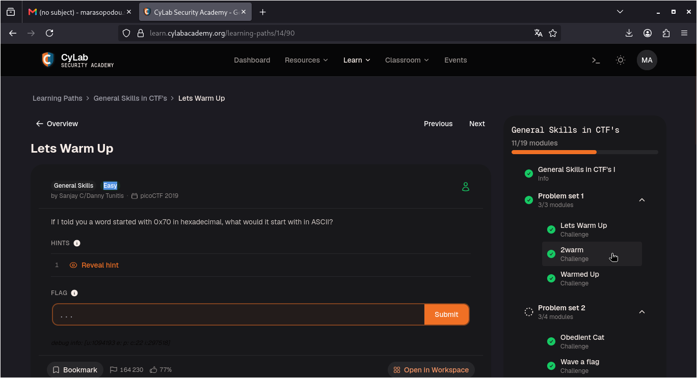
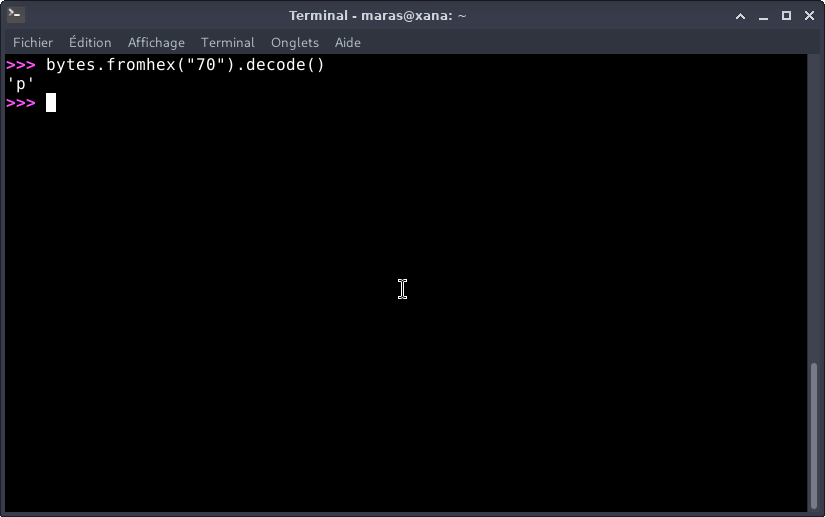
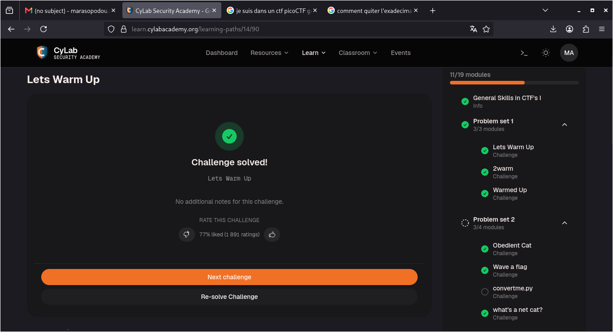

# Lets Warm Up — PicoCTF

**Catégorie :** General Skills  

**Points :** ✅  

**Difficulté :** Easy  

**Date :** 21/08/2026

---

## 📌 Description

Pour ce niveau, il faut juste convertir 0x70 (hexa) en ASCII.  


---

## 🔍 Solution

- La conversion sera réalisée à l'aide d'un script Python pour automatiser la résolution. 

**Payload utilisé :**


```python
bytes.fromhex("70").decode()
```
**Réponse :**  
```python
'p'
```
---

## 📸 Screenshot




---

## 🚩 Flag

```
picoCTF{p}
```

---

## 💡 Ce que j'ai appris

Ce niveau montre comment décoder rapidement une valeur hexadécimale en ASCII. C'est une compétence de base en CTF pour traduire des données brutes en texte clair grâce à Python.

---
*Malick Ramzy SOPODOU — PicoCTF*
