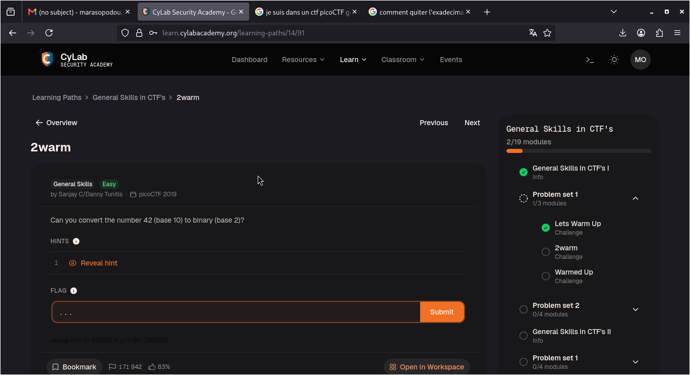
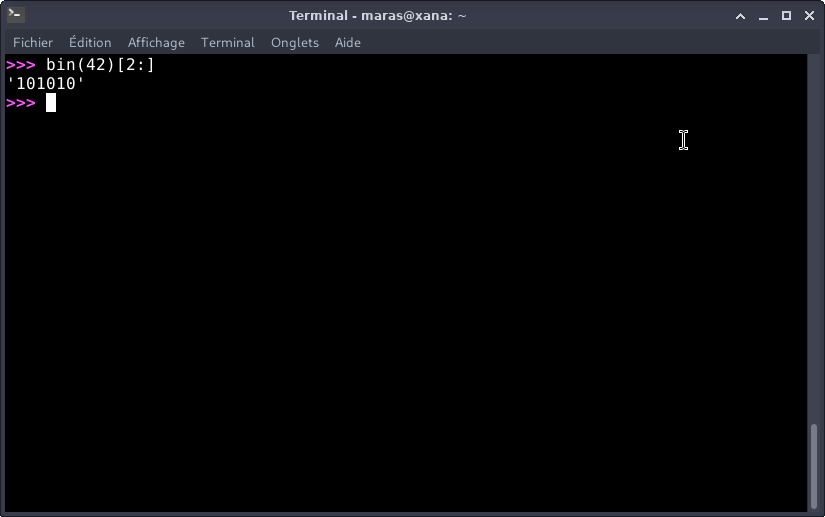

# 2warm — PicoCTF

**Catégorie :** General Skills  

**Points :** ✅  

**Difficulté :** Easy  

**Date :** 21/08/2026


---

## 📌 Description

*Pour ce niveau, il faut juste convertir 42 (base 10) en binaire (base 2) .*



---

## 🔍 Solution

La conversion sera réalisée à l'aide d'un script Python pour automatiser la résolution. 
**Payload utilisé :**


```python
bin(42)[2:]
```


**Réponse :**

```python
'101010'
```
---

## 📸 Screenshot



---

## 🚩 Flag

```
picoCTF{101010}
```

---

## 💡 Ce que j'ai appris

Ce qu'il faut retenir, c'est l'importance de maîtriser les conversions de bases numériques. Savoir passer du décimal au binaire est un automatisme indispensable pour avancer dans les défis de type "General Skills".

---
*Malick Ramzy SOPODOU — PicoCTF*
