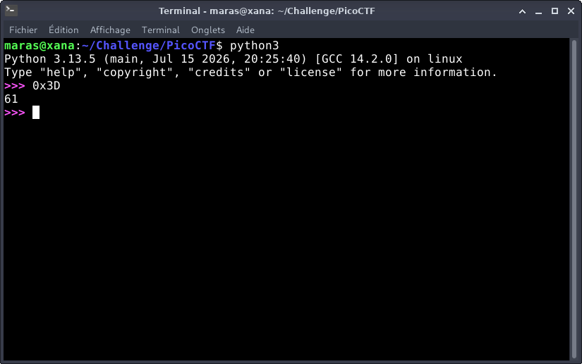

# Warmed Up — PicoCTF

**Catégorie :** General Skills  

**Points :** ✅  

**Difficulté :** Easy  

**Date :** 22/08/2026


---

## 📌 Description

*Ce défi consiste à convertir la valeur hexadécimale 0x3D en un entier décimal.* 


---

## 🔍 Solution

 La conversion sera réalisée à l'aide d'un script Python pour automatiser la résolution.  

 
**Payload utilisé :**
- L'interpréteur interactif de Python évalue et convertit automatiquement les valeurs préfixées par 0x en entiers décimaux.

```python
0x3D
```


**Réponse :**

```bash
61
```
---

## 📸 Screenshot



---

## 🚩 Flag

```
picoCTF{61}
```

---
*Malick Ramzy SOPODOU — PicoCTF*
