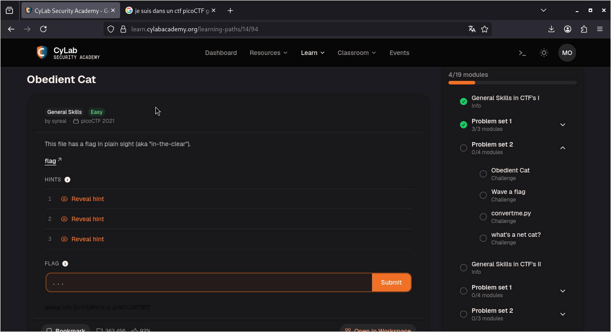

# Obedient Cat — PicoCTF

**Catégorie :** General Skills  

**Points :** ✅  

**Difficulté :** Easy  

**Date :** 22/08/2026


---

## 📌 Description

Ce défi nécessite de télécharger le fichier cible afin d'en extraire le flag sous forme de texte brut. 


---

## 🔍 Solution

<!-- Explique en 2-3 phrases ce que tu as fait -->
**Payload utilisé :**


```bash
cat flag
```


**Réponse :**

```bash
picoCTF{s4n1ty_v3r1f13d_9b8fa0bc}
```
---

## 📸 Screenshot


---

## 🚩 Flag

```
picoCTF{s4n1ty_v3r1f13d_9b8fa0bc}
```

---

*Malick Ramzy SOPODOU — PicoCTF*
