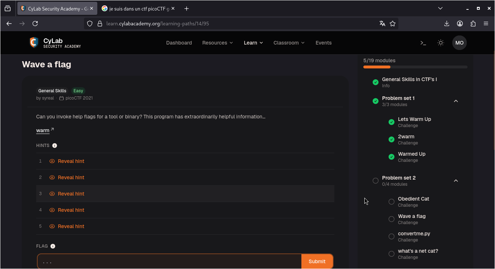
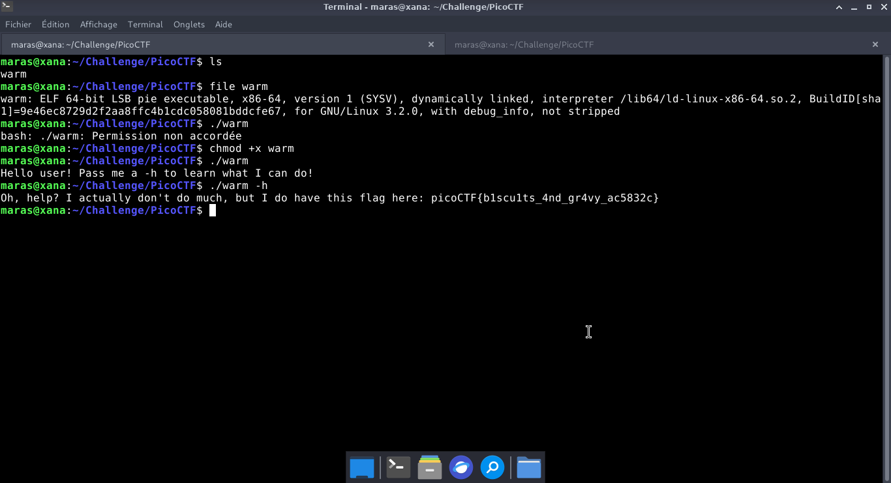

# Wave a flag — PicoCTF

**Catégorie :** General Skills  

**Points :** ✅  

**Difficulté :** Easy  

**Date :** 22/08/2026


---

## 📌 Description

<!-- Colle la description originale du challenge ici -->

---

## 🔍 Solution

<!-- Explique en 2-3 phrases ce que tu as fait -->

**Payload utilisé :**

---
- Étape 1 : Analyser la nature du fichier à l'aide de la commande file.  
- Étape 2 : Accorder les droits d'exécution au binaire via chmod +x warm.
- Étape 3 : Lancer une première exécution du programme.
- Étape 4 : Réexécuter le fichier en lui passant l'argument -h pour consulter l'aide intégrée.  
---

```bash
./warm -h)
```


**Réponse :**

```bash
Oh, help? I actually don't do much, but I do have this flag here: picoCTF{b1scu1ts_4nd_gr4vy_ac5832c}
```
---

## 📸 Screenshot



---

## 🚩 Flag

```
picoCTF{b1scu1ts_4nd_gr4vy_ac5832c}
```


---
*Malick Ramzy SOPODOU — PicoCTF*
