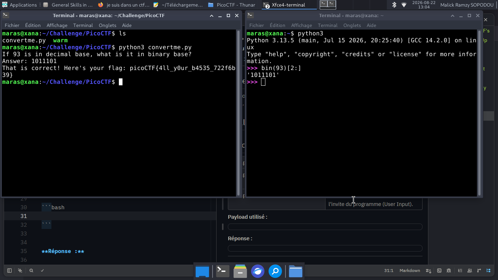

# convertme.py — PicoCTF

**Catégorie :** General Skills  

**Points :** ✅  

**Difficulté :** Easy  

**Date :** 22/08/2026


---

## 📌 Description

La résolution de ce défi repose sur l'exécution du script Python afin d'en extraire le flag.


---

## 🔍 Solution
---
- Étape 1 : Lancer l'exécution du script Python.
- Étape 2 : Calculer la valeur binaire correspondant à l'entier décimal 93.
- Étape 3 : Soumettre la réponse obtenue à l'invite du programme (User Input).
---
**Payload utilisé :**


```bash
python3 convertme.py
```
```python
bin(93)[2:]
```
---

## 📸 Screenshot



---

## 🚩 Flag

```
picoCTF{4ll_y0ur_b4535_722f6b39}
```


---
*Malick Ramzy SOPODOU — PicoCTF*
