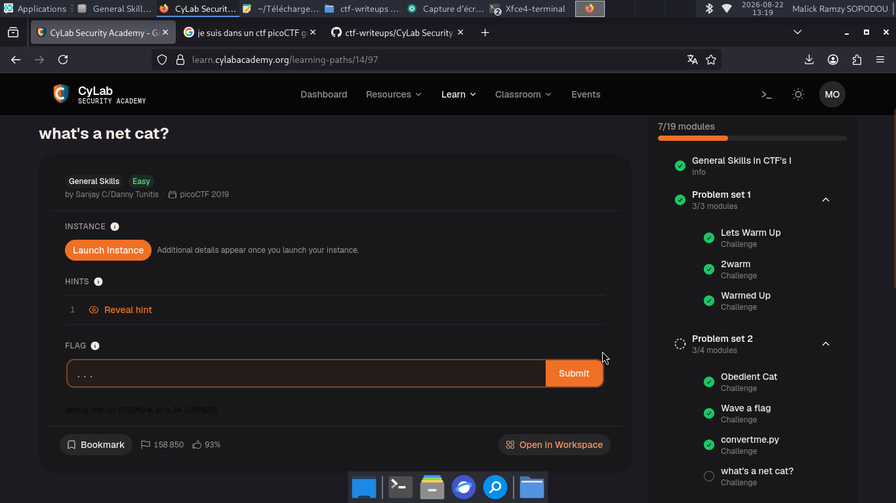
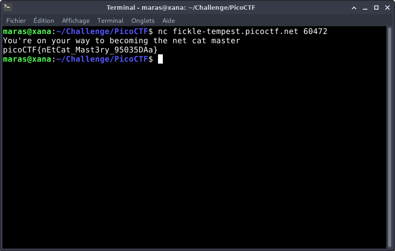

# what's a net cat? — PicoCTF

**Catégorie :** General Skills  

**Points :** ✅  

**Difficulté :** Easy  

**Date :** 21/08/2026


---

## 📌 Description

 La résolution de ce défi nécessite d'établir une connexion réseau via l'utilitaire Netcat vers l'hôte fickle-tempest.picoctf.net sur le port 60472 afin de récupérer le flag. 
 

---

## 🔍 Solution

-  La syntaxe générique pour initialiser une connexion TCP avec l'utilitaire Netcat s'articule ainsi : nc [adresse_hôte] [port].
**Payload utilisé :**


```bash
nc fickle-tempest.picoctf.net 60472
```


**Réponse :**

```bash
You're on your way to becoming the net cat master
picoCTF{nEtCat_Mast3ry_95035DAa}

```
---

## 📸 Screenshot



---

## 🚩 Flag

```
picoCTF{nEtCat_Mast3ry_95035DAa}
```

---
*Malick Ramzy SOPODOU — PicoCTF*
