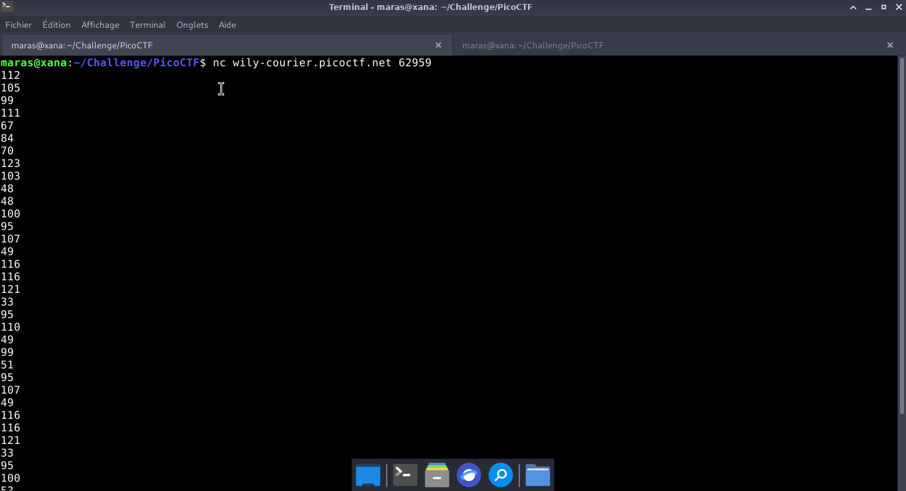
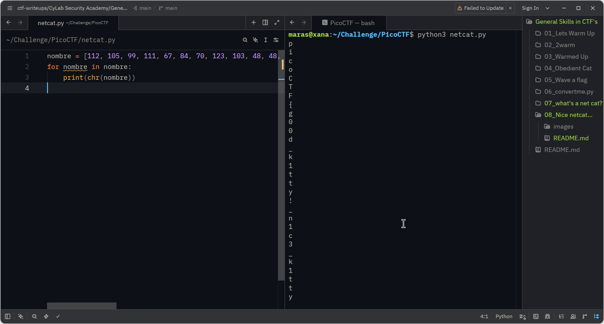

# Nice netcat... — PicoCTF

**Catégorie :** General Skills  

**Points :** ✅  

**Difficulté :** Easy  

**Date :** 21/08/2026


---

## 📌 Description

 Ce défi consiste à initier une session TCP via Netcat afin d'interagir avec le serveur distant et d'en extraire le flag.
 

---

## 🔍 Solution

 L'étape suivante consiste à automatiser le décodage via un script Python qui transforme la liste de nombres décimaux en texte ASCII.  
 
**Payload utilisé :**


```bash
nc wily-courier.picoctf.net 55921
```
**Réponse :**

```bash

```



## **code d'automatisation python pour la conversion en ASCII**  


```python
nombre = [112, 105, 99, 111, 67, 84, 70, 123, 103, 48, 48, 100, 95, 107, 49, 116, 116, 121, 33, 95, 110, 49, 99, 51, 95, 107, 49, 116, 116, 121, 33, 95, 100, 53, 100, 56, 56, 125, 10]
for nombre in nombre:
    print(chr(nombre))
```

**Réponse :**

```python
p
i
c
o
C
T
F
{
    g
    0
    0
    d
    _
    k
    1
    t
    t
    y
    !
    _
    n
    1
    c
    3
    _
    k
    1
    t
    t
    y
    !
    _
    d
    5
    d
    8
    8
}

```
---

## 📸 Screenshot



---

## 🚩 Flag

```
picoCTF{g00d_k1tty!_n1c3_k1tty!_d5d88}
```

---
*Malick Ramzy SOPODOU — PicoCTF*
