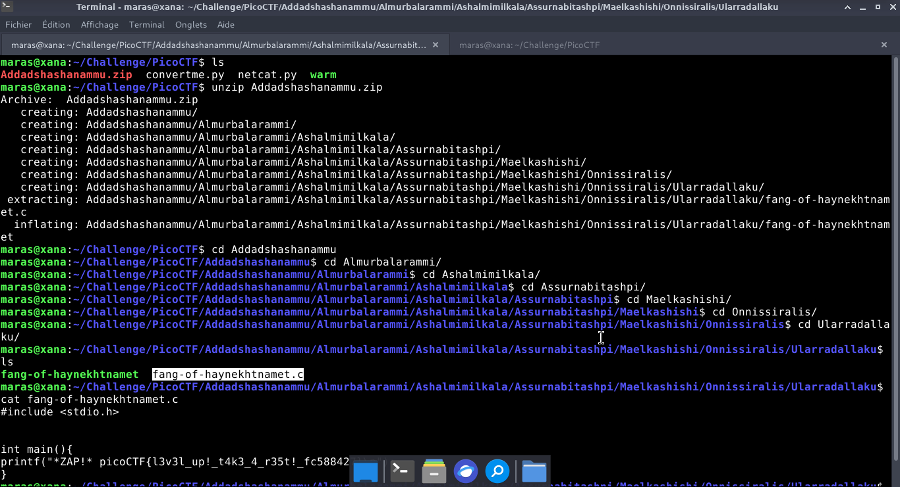

# Tab, Tab, Attack — PicoCTF

**Catégorie :** General Skills  

**Points :** ✅  

**Difficulté :** Easy  

**Date :** 22/08/2026


---

## 📌 Description

Ce défi nécessite d'extraire l'archive ZIP afin de fouiller l'arborescence des sous-répertoires à la recherche du flag. 


---

## 🔍 Solution

<!-- Explique en 2-3 phrases ce que tu as fait -->
**Payload utilisé :**


```bash
unzip Addadshashanammu.zip

```
- La résolution implique de parcourir l'arborescence des répertoires afin de localiser le fichier spécifique abritant le flag. 

**Réponse :**

```bash
aku/fang-of-haynekhtnamet.c
#include <stdio.h>


int main(){
printf("*ZAP!* picoCTF{l3v3l_up!_t4k3_4_r35t!_fc588427}\n");
}

```
---

## 📸 Screenshot



---

## 🚩 Flag

```
picoCTF{l3v3l_up!_t4k3_4_r35t!_fc588427}
```

---
*Malick Ramzy SOPODOU — PicoCTF*
