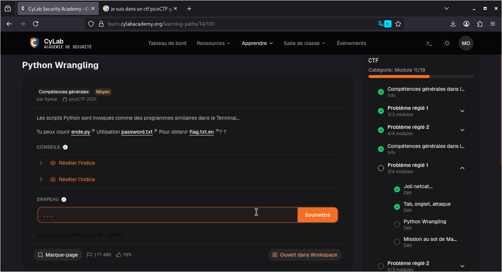
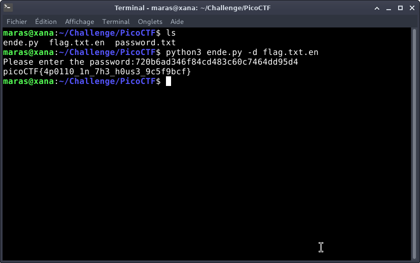

# Python Wrangling — PicoCTF

**Catégorie :** General Skills  

**Points :** ✅  

**Difficulté :** Easy  

**Date :** 22/08/2026


---

## 📌 Description

Ce défi consiste à exécuter le script de déchiffrement ende.py en lui passant le mot de passe contenu dans password.txt afin de décoder le fichier chiffré flag.txt.en


---

## 🔍 Solution

---
- Étape 1 : Analyser le code source du programme Python pour comprendre son fonctionnement.
- Étape 2 : Consulter l'aide intégrée du script en lui passant l'argument -h.
- Étape 3 : Identifier la syntaxe et les paramètres obligatoires requis par le script.
- Étape 4 : Exécuter le script avec les bons arguments afin d'en extraire le flag.
---
**Payload utilisé :** 


```bash
python3 ende.py -d flag.txt.en 
```


**Réponse :**

```bash
Please enter the password:720b6ad346f84cd483c60c7464dd95d4
picoCTF{4p0110_1n_7h3_h0us3_9c5f9bcf}
```
---

## 📸 Screenshot



---

## 🚩 Flag

```
picoCTF{4p0110_1n_7h3_h0us3_9c5f9bcf}
```

---

*Malick Ramzy SOPODOU — PicoCTF*
