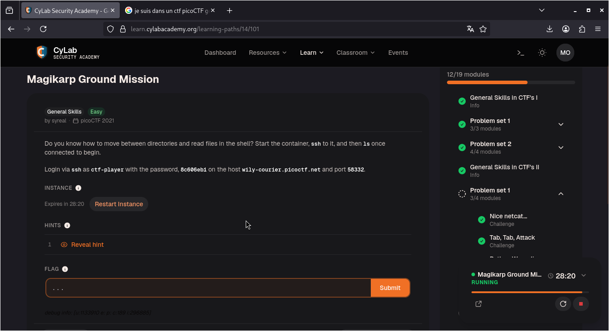
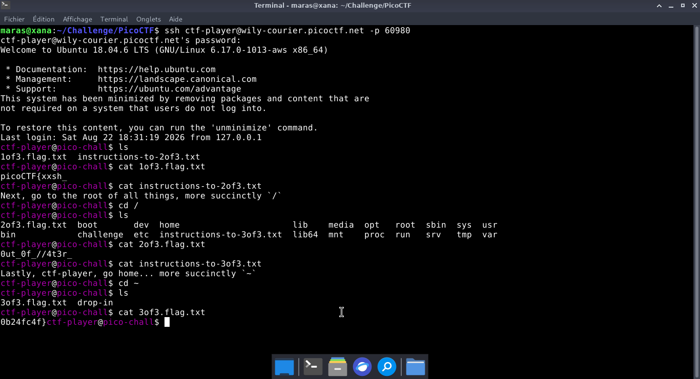
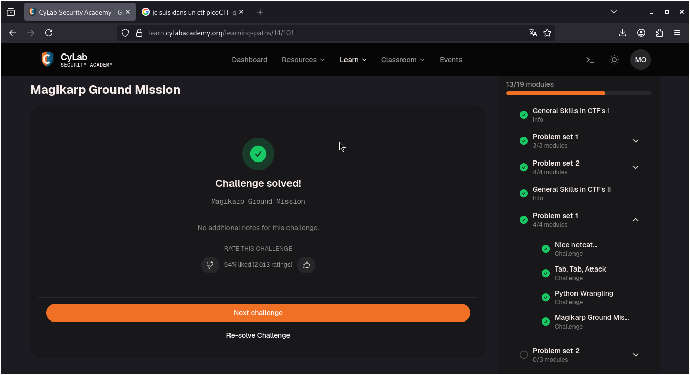

# Magikarp Ground Mission — PicoCTF

**Catégorie :** General Skills  

**Points :** ✅  

**Difficulté :** Easy  

**Date :** 21/08/2026


---

## 📌 Description

La résolution de ce défi nécessite d'établir une session SSH à distance. Nous devons nous authentifier en tant que ctf-player sur l'hôte wily-courier.picoctf.net via le port spécifique 60980. 


---

## 🔍 Solution

<!-- Explique en 2-3 phrases ce que tu as fait -->
**Payload utilisé :**


```bash
ssh ctf-player@wily-courier.picoctf.net -p 60980

ls
cat 1of3.flag.txt
cd /
ls
cat 2of3.flag.txt
cat instructions-to-3of3.txt
cd ~
ls
cat 3of3.flag.txt
```
- Une fois sur le serveur, nous allons parcourir le système de fichiers pour dénicher l'emplacement exact du flag

**Réponse :**

```bash
picoCTF{xxsh_
0ut_0f_//4t3r_
0b24fc4f}
```
---

## 📸 Screenshot



---

## 🚩 Flag

```
picoCTF{xxsh_0ut_0f_//4t3r_0b24fc4f}
```



---
*Malick Ramzy SOPODOU — PicoCTF*
