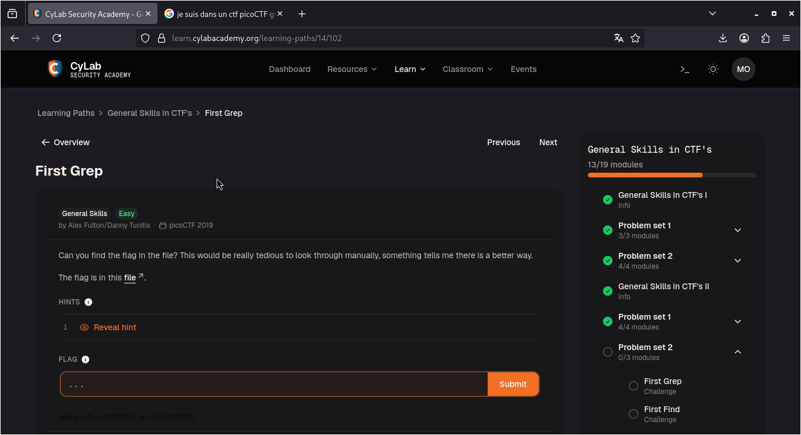
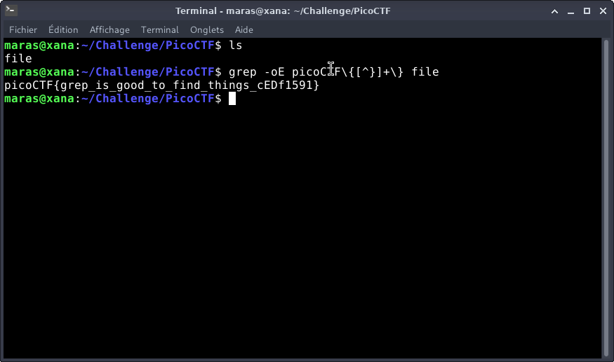

# First Grep — PicoCTF

**Catégorie :** General Skills  

**Points :** ✅  

**Difficulté :** Easy  

**Date :** 22/08/2026


---

## 📌 Description

Pour ce niveau, il faut juste chercher et trouver le flag à l'intérieur du fichier file


---

## 🔍 Solution

<!-- Explique en 2-3 phrases ce que tu as fait -->
**Payload utilisé :**


```bash
grep -oE picoCTF\{[^}]+\} file
```


**Réponse :**

```bash
picoCTF{grep_is_good_to_find_things_cEDf1591}
```
---

## 📸 Screenshot



---

## 🚩 Flag

```
picoCTF{grep_is_good_to_find_things_cEDf1591}
```

---

*Malick Ramzy SOPODOU — PicoCTF*
