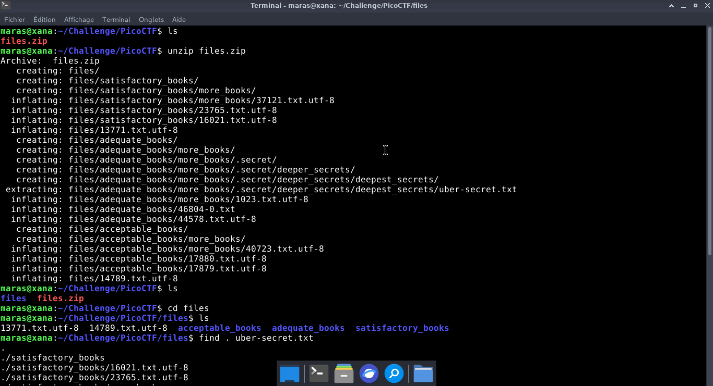
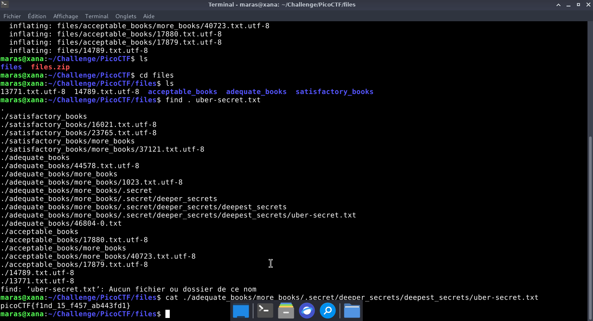

# First Find — PicoCTF

**Catégorie :** General Skills  

**Points :** ✅  

**Difficulté :** Easy  

**Date :** 22/08/2026


---

## 📌 Description

L'objectif est d'extraire les données de l'archive ZIP, puis de naviguer dans les sous-répertoires pour récupérer le fichier uber-secret.txt qui contient le flag.


---

## 🔍 Solution

Nous allons utiliser la commande grep find. 

**Payload utilisé :**


```bash
unzip files.zip
cd files
find . uber-secret.txt
```


**Réponse :**

```bash
picoCTF{f1nd_15_f457_ab443fd1}
```
---

## 📸 Screenshot



---

## 🚩 Flag

```
picoCTF{f1nd_15_f457_ab443fd1}
```


---

*Malick Ramzy SOPODOU — PicoCTF*
