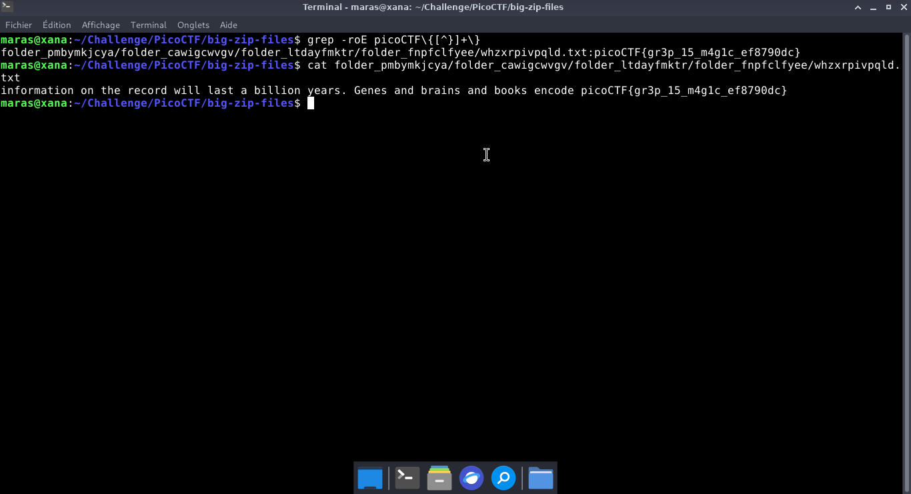

# Big Zip — PicoCTF

**Catégorie :** General Skills  

**Points :** ✅  

**Difficulté :** Easy  

**Date :** 21/08/2026


---

## 📌 Description

Ce défi nécessite de localiser le flag dissimulé au sein de l'arborescence complexe issue de la décompression de l'archive big-zip-files.zip.


---

## 🔍 Solution

<!-- Explique en 2-3 phrases ce que tu as fait -->
**Payload utilisé :**


```bash
unzip big-zip-files.zip 
grep -roE picoCTF\{[^}]+\}
```


**Réponse :**

```bash
information on the record will last a billion years. Genes and brains and books encode picoCTF{gr3p_15_m4g1c_ef8790dc}
```
---

## 📸 Screenshot



---

## 🚩 Flag

```
picoCTF{gr3p_15_m4g1c_ef8790dc}
```


---

## 💡 Ce que j'ai appris

<!-- Une seule phrase -->

---
*Malick Ramzy SOPODOU — PicoCTF*
