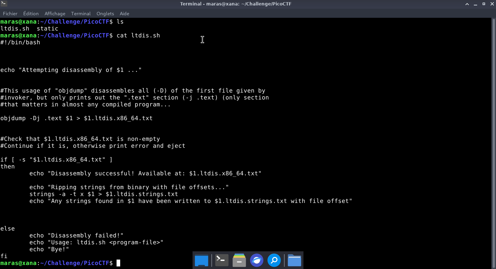
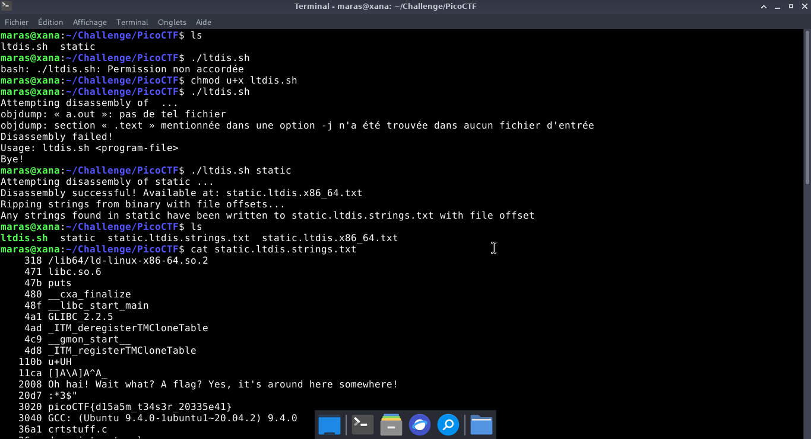

# Static ain't always noise — PicoCTF

**Catégorie :** General Skills  

**Points :** ✅  

**Difficulté :** Easy  

**Date :** 21/08/2026


---

## 📌 Description

 Pour ce niveau, il suffit d'utiliser le script Bash fourni par le challenge pour lancer et exploiter le fichier binaire et obtenir le flag.
 

---

## 🔍 Solution

---
- Étape 1 : Rendre le script Bash fourni exécutable en modifiant ses droits d'accès via chmod u+x ltdis.sh.
- Étape 2 : Consulter l'aide ou la syntaxe du script en effectuant une première exécution à blanc (./ltdis.sh).
- Étape 3 : Exécuter le script final en lui passant le binaire static en argument afin de procéder à son analyse.
--- 
**Payload utilisé :**


```bash
chmod u+x ltdis.sh
./ltdis.sh
./ltdis.sh static
cat static.ltdis.strings.txt
```


**Réponse :**

```bash
318 /lib64/ld-linux-x86-64.so.2
   471 libc.so.6
   47b puts
   480 __cxa_finalize
   48f __libc_start_main
   4a1 GLIBC_2.2.5
   4ad _ITM_deregisterTMCloneTable
   4c9 __gmon_start__
   4d8 _ITM_registerTMCloneTable
  110b u+UH
  11ca []A\A]A^A_
  2008 Oh hai! Wait what? A flag? Yes, it's around here somewhere!
  20d7 :*3$"
  3020 picoCTF{d15a5m_t34s3r_20335e41}

```
---

## 📸 Screenshot




---

## 🚩 Flag

```
picoCTF{d15a5m_t34s3r_20335e41}
```

---

*Malick Ramzy SOPODOU — PicoCTF*
