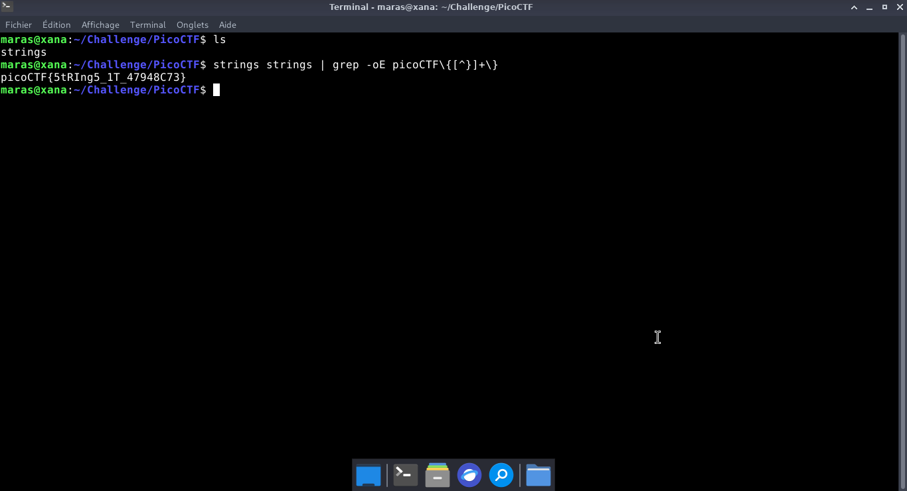

# strings it — PicoCTF

**Catégorie :** General Skills  

**Points :** ✅  

**Difficulté :** Easy  

**Date :** 22/08/2026


---

## 📌 Description

Pour ce niveau, il faut simplement chercher le flag à l'intérieur du fichier strings.


---

## 🔍 Solution

Le fichier étant un exécutable binaire, nous emploierons l'utilitaire strings afin d'extraire et d'afficher les chaînes de caractères ASCII imprimables qui y sont dissimulées. 

**Payload utilisé :**


```bash
strings strings | grep -oE picoCTF\{[^}]+\}
```


**Réponse :**

```bash
picoCTF{5tRIng5_1T_47948C73}
```
---

## 📸 Screenshot



---

## 🚩 Flag

```
picoCTF{5tRIng5_1T_47948C73}
```


---
*Malick Ramzy SOPODOU — PicoCTF*
