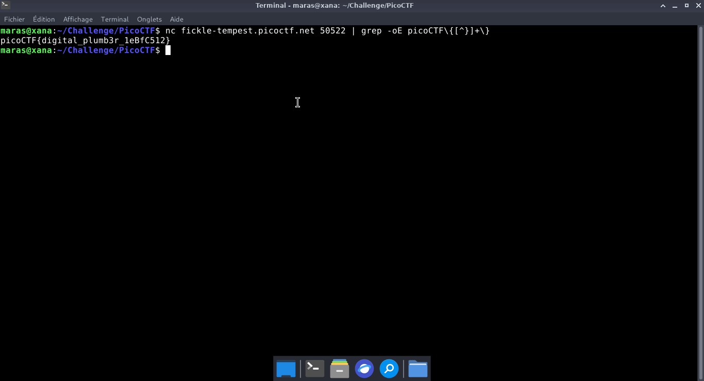
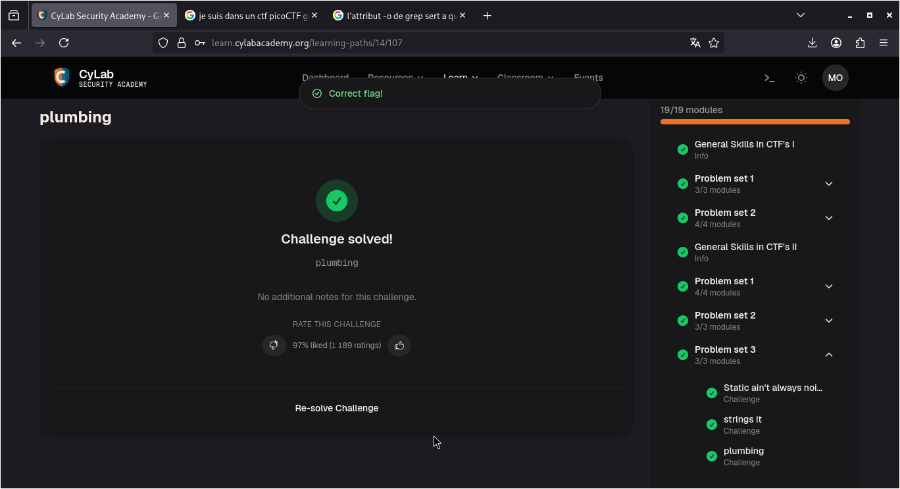

# plumbing — PicoCTF

**Catégorie :** General Skills  

**Points :** ✅  

**Difficulté :** Easy  

**Date :** 22/08/2026


---

## 📌 Description

Ce défi nécessite d'initialiser une session réseau avec l'utilitaire Netcat afin d'intercepter et d'analyser le flux de données entrant pour y extraire le flag. 


---

## 🔍 Solution

Nous allons rediriger le flux de sortie standard via un tube (pipe |) vers la commande grep. Cela permettra de filtrer les données et d'isoler uniquement le flag, dont nous connaissons déjà le format prédéfini. 

**Payload utilisé :**


```bash
nc fickle-tempest.picoctf.net 50522 | grep -oE picoCTF\{[^}]+\}
```


**Réponse :**

```bash
picoCTF{digital_plumb3r_1eBfC512}
```
---

## 📸 Screenshot



---

## 🚩 Flag

```
picoCTF{digital_plumb3r_1eBfC512}
```

---

## 💡 Ce que j'ai appris

<!-- Une seule phrase -->

---
*Malick Ramzy SOPODOU — PicoCTF*
