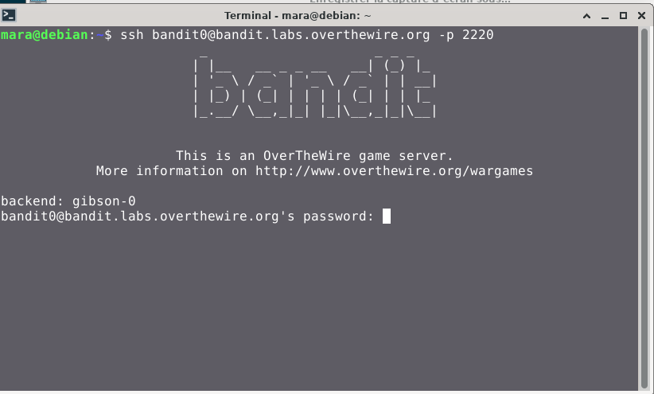
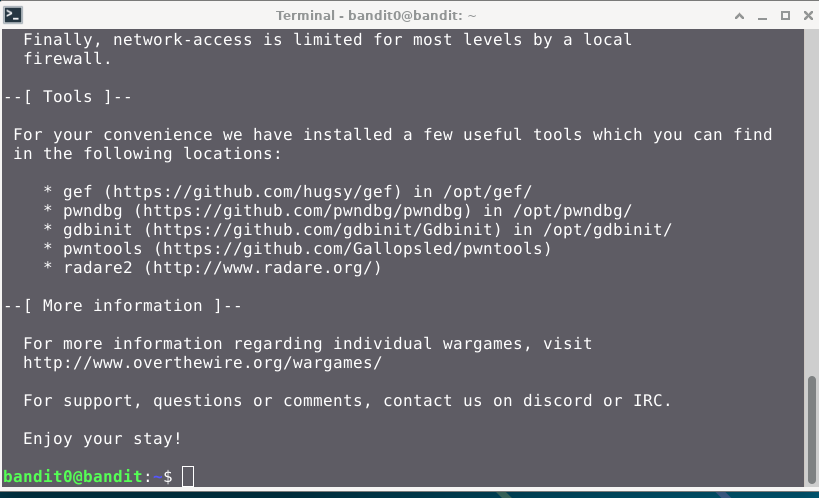

# Bandit — Niveau 0

## 📌 Informations
- **Plateforme :** OverTheWire
- **Série :** Bandit
- **Niveau :** 0
- **Difficulté :** Débutant
- **Date :** 08/06/2026

---

## 🎯 Objectif
L'objectif de ce niveau est de pouvoir se connecter au jeu via `SSH`
.

---

## 🔍 Réflexion avant de commencer
La plateforme a mis à disposition `l'hôte` auquel nous devons nous connecter, le `port`, l'utilisateur et le `mot de passe`.


---

## 🛠️ Commandes données en indice


| Commande | Rôle |
|---|---|
| `ssh` | Se connecter au serveur |
---
## 🔎 comprendre la commande 

**Syntaxe de base**: `ssh utilisateur@adresse -p [PORT]` .  
**Utilisateur**: c'est lidentifiant de connexion.  
**Adresse**: L'adresse peut etre une adresse `IP` ou un `nom de domaine`.  
**-p**: L'attribut qui permet de specifier le numero de port via lequel nous allons nous connecte.  
**[PORT]**: Le port en question.  

## 📖 Résolution

### Étape 1 - Identification

**Utilisateur**: `bandit0`  
**Passwd**: `bandit0` .  
**Adresse**: `bandit.labs.overthewire.org`  .  
**[PORT]**: `2220`


### Étape 2 — Application

```
ssh bandit0@bandit.labs.overthewire.org -p 2220
```  
   

**Résultat_1** :

  
Enter le **password** `bandit0` pour etablir la connexion.  
  
    
**Résultat_2** :  
  
  


---

## 💡 Ce que j'ai appris
- Pour se connecter a un serveur via `SSH` nous avons besoin d'un identifiant e connexion, d'une adresse( IP, Nom de Dommaine) et d'un port specifique.


---

## 🔗 Références
- [Page officielle Bandit](https://overthewire.org/wargames/bandit/)
