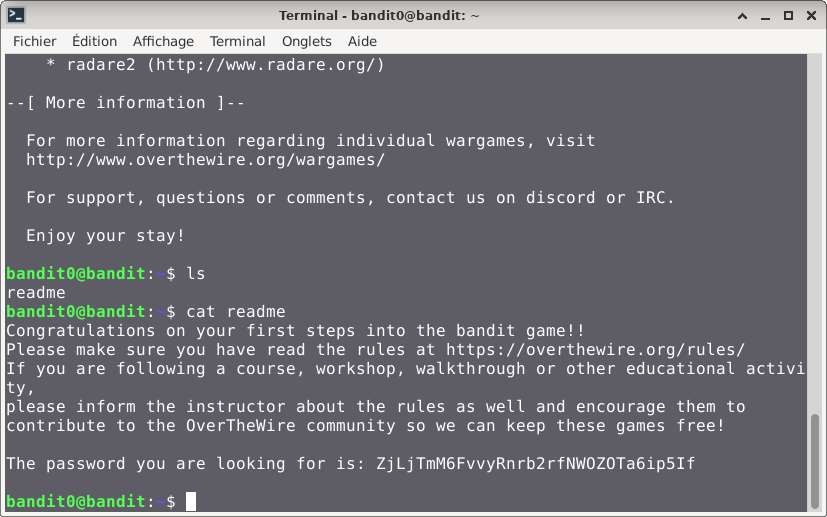

# Bandit — Niveau 0 → 1

## 📌 Informations
- **Plateforme :** OverTheWire
- **Série :** Bandit
- **Niveau :** 0 → 1
- **Difficulté :** Débutant
- **Date :** 08/06/2026

---

## 🎯 Objectif
trouver le mot de passe du niveau suivant dans dans un fichier appelé `readme` situé dans le répertoire d'accueil situé dans le répertoire d'accueil

---

## 🔍 Réflexion avant de commencer.  
nous devons trouver le répertoire d'accueil et chercher le mot de passe dans le fichier readme


---

## 🛠️ Commandes données en indice

| Commande | Rôle |
|---|---|
| `cd` | permet de naviguer à l'intérieur de l'arborescence des dossiers. |
| `ls` | Lister les fichiers |
| `cat` | Lire le contenu d'un fichier |
| `file` | analyser un ou plusieurs fichiers pour en déterminer le type exact |
| `du` | estimer l'espace disque occupé par les fichiers et les répertoires |
| `find` | sert à localiser des fichiers et des répertoires au sein de l'arborescence du système |

---


## 📖 Résolution

### Étape 1 — Connexion au serveur

```bash
ssh bandit0@bandit.labs.overthewire.org -p 2220
```

Le mot de passe utilisé est celui obtenu au niveau 0.

### Étape 2 — Vérifier les fichiers présents

```bash
ls 
```

Résultat :
```
readme
```

Je vois bien le fichier avec des readme dans le repertoire.

### Étape 3 — lire le contenu du fichier readme

```bash
cat readme
```

Résultat :
```
The password you are looking for is: ZjLjTmM6FvvyRnrb2rfNWOZOTa6ip5If
```

## Visuel


## 🚩 Flag obtenu
```
ZjLjTmM6FvvyRnrb2rfNWOZOTa6ip5If
```

---

## 💡 Ce que j'ai appris
la commande `ls` permet de lister le contenu d'un répertoire et la commande `cat` permet d'afficher le contenu d'un fichier directement dans l'invite de commande

---

## 🔗 Références
- [Page officielle Bandit](https://overthewire.org/wargames/bandit/)