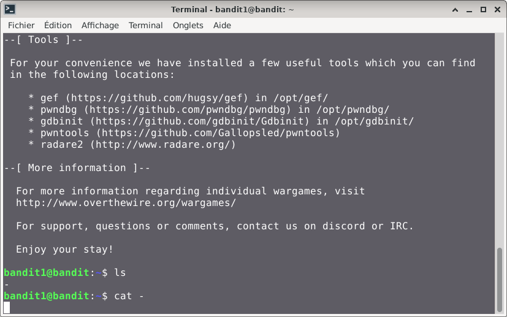
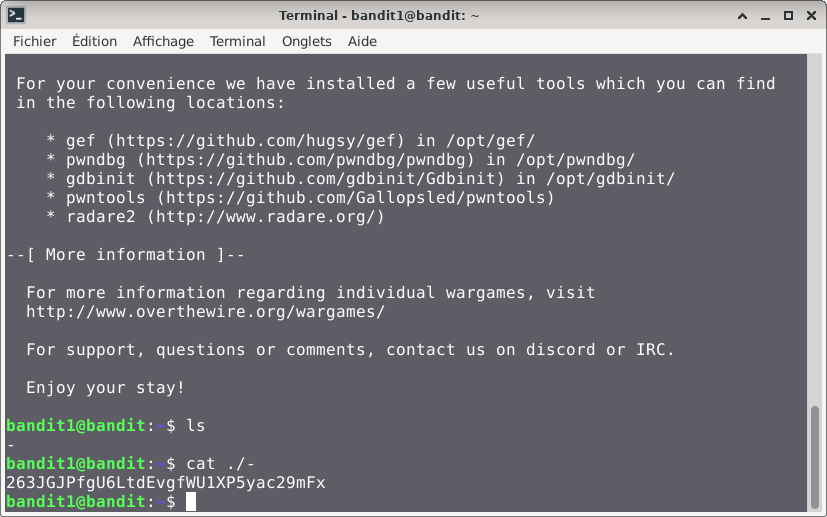

# Bandit — Niveau 1 → 2

## 📌 Informations
- **Plateforme :** OverTheWire
- **Série :** Bandit
- **Niveau :** 1 → 2
- **Difficulté :** Débutant
- **Date :** 08/06/2026

---

## 🎯 Objectif
trouver le mot de passe du niveau suivant qui se trouve dans un fichier stocké dans le reprtoire `home` 

---

## 🔍 Réflexion avant de commencer.  
nous devons trouver le répertoire `home` et chercher le mot de passe dans un fichier du repertoire en question.


---

## 🛠️ Commandes données en indice

| Commande | Rôle |
|---|---|
| `cd` | permet de naviguer à l'intérieur de l'arborescence des dossiers. |
| `ls` | Lister les fichiers |
| `cat` | Lire le contenu d'un fichier |
| `file` | analyser un ou plusieurs fichiers pour en déterminer le type exact |
| `du` | estimer l'espace disque occupé par les fichiers et les répertoires |
| `find` | sert à localiser des fichiers et des répertoires au sein de l'arborescence du système |

---


## 📖 Résolution

### Étape 1 — Connexion au serveur

```bash
ssh bandit1@bandit.labs.overthewire.org -p 2220
```

Le mot de passe utilisé est celui obtenu au niveau 0 → 1.

### Étape 2 — Vérifier les fichiers présents

```bash
ls 
```

Résultat :
```
bandit1@bandit:~$ ls
-
```

Je vois bien le fichier `-` dans le repertoire.

### Étape 3 — je vais lire le contenu du fichier avec cat
#### première tentative

```bash
cat -
```

Résultat :

## Visuel

#### Deuxième tentatives

```bash
cat ./-
```

Résultat :
`263JGJPfgU6LtdEvgfWU1XP5yac29mFx`
## Visuel

## 🚩 Flag obtenu
```
263JGJPfgU6LtdEvgfWU1XP5yac29mFx
```

---

## 💡 Ce que j'ai appris
Le préfixe `./` indique au système de chercher le fichier dans le dossier actuel.
car le terminal Linux/Unix interprète tout nom commençant par un tiret `-` comme une option ou un paramètre pour la commande, ce qui provoque généralement une erreur.

---

## 🔗 Références
- [Page officielle Bandit](https://overthewire.org/wargames/bandit/)