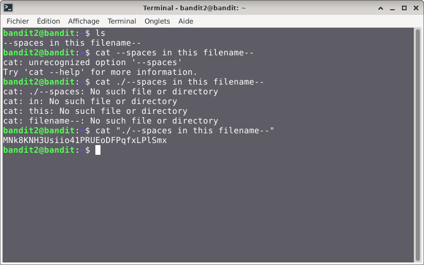

# Bandit — Niveau 2 → 3

## 📌 Informations
- **Plateforme :** OverTheWire
- **Série :** Bandit
- **Niveau :** 2 → 3
- **Difficulté :** Débutant
- **Date :** 09/06/2026

---

## 🎯 Objectif
Le mot de passe est stocké dans un fichier appelé
**spaces in this filename** situé dans le répertoire home.

---

## 🔍 Réflexion avant de commencer
Le nom du fichier contient des espaces.
En Linux un espace sépare les arguments d'une commande.
Donc `cat spaces in this filename` va chercher
4 fichiers différents au lieu d'un seul.
Il faut trouver un moyen de dire au terminal
que c'est un seul fichier.

---

## 🛠️ Commandes utilisées

| Commande | Rôle |
|---|---|
| `ssh` | Se connecter au serveur |
| `ls` | Lister les fichiers |
| `cat` | Lire le contenu d'un fichier |

---

## 📖 Résolution

### Étape 1 — Connexion au serveur

```bash
ssh bandit2@bandit.labs.overthewire.org -p 2220
```

Le mot de passe utilisé est celui obtenu au niveau 1.

### Étape 2 — Vérifier les fichiers présents

```bash
ls 
```

Résultat :
```
--spaces in this filename--
```

Je vois bien le fichier avec des espaces dans son nom.

### Étape 3 — Première tentative qui échoue

```bash
cat --spaces in this filename--
```

Résultat :
```
cat: ./--spaces: No such file or directory
cat: in: No such file or directory
cat: this: No such file or directory
cat: filename--: No such file or directory
```

Le terminal interprète chaque mot comme un fichier séparé.
Exactement ce que j'avais prévu dans ma réflexion.

### Étape 4 — Solution avec les guillemets

```bash
cat "./--spaces in this filename--"
```

Les guillemets indiquent au terminal que tout ce qui est entre eux est un seul argument et Le préfixe `./` indique au système de chercher le fichier dans le dossier actuel.

---
## visuel




## 🚩 Flag obtenu
```
MNk8KNH3Usiio41PRUEoDFPqfxLPlSmx
```

---

## 💡 Ce que j'ai appris
- En Linux l'espace est un **séparateur d'arguments**
- Les **guillemets** permettent de grouper un nom avec espaces


---

## ⚠️ Les erreurs que j'ai faites
J'ai d'abord essayé `--cat spaces in this filename--`
sans guillemets ce qui m'a donné 4 erreurs.
Ça m'a confirmé que Linux traite chaque mot
séparé par un espace comme un argument distinct.
Cette erreur m'a appris quelque chose d'important
sur le fonctionnement du terminal.

---

## 🔗 Références
- [Page officielle Bandit](https://overthewire.org/wargames/bandit/)
