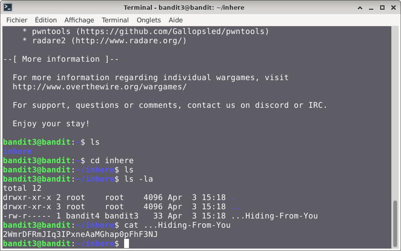

# Bandit — Niveau 3 → 4

## 📌 Informations
- **Plateforme :** OverTheWire
- **Série :** Bandit
- **Niveau :** 3 → 4
- **Difficulté :** Débutant
- **Date :** 09/06/2026

---

## 🎯 Objectif
Le mot de passe pour le niveau suivant est stocké dans un fichier caché dans le répertoire `inhere`.

---

## 🔍 Réflexion avant de commencer
Le mot de passe est dans un fichier caché dans le répertoire `inhere`.
nous allons donc entrer dans le répertoire `inhere` et trouver le fichier caché.

---

## 🛠️ Commandes utilisées

| Commande | Rôle |
|---|---|
| `ssh` | Se connecter au serveur |
| `ls` | Lister les fichiers |
| `cat` | Lire le contenu d'un fichier |
| `cd` | se déplacer dans les répertoires |
---

## 📖 Résolution

### Étape 1 — Connexion au serveur

```bash
ssh bandit3@bandit.labs.overthewire.org -p 2220
```

Le mot de passe utilisé est celui obtenu au niveau precedent.

### Étape 2 — Vérifier les fichiers présents

```bash
ls 
```

Résultat :
```
inhere
```

Je vois bien le dossier `inhere`.

#### entrer dans le dossier inhere
```bash
cd inhere
```
  
### Étape 3 — Première tentative qui échoue

```bash
ls
```
Résultat :  
```

```
le repertoire est vide.


### Étape 4 — Solution avec ls -la

```bash
ls -la
```
Résultat :  
```
total 12
drwxr-xr-x 2 root    root    4096 Apr  3 15:18 .
drwxr-xr-x 3 root    root    4096 Apr  3 15:18 ..
-rw-r----- 1 bandit4 bandit3   33 Apr  3 15:18 ...Hiding-From-You

```
le fichier cacher est donc : `...Hiding-From-You` .  

#### Trouver le mot de passe  

```bash
cat ...Hiding-From-You
```
Résultat :  
```
2WmrDFRmJIq3IPxneAaMGhap0pFhF3NJ
```

---
## visuel




## 🚩 Flag obtenu
```
2WmrDFRmJIq3IPxneAaMGhap0pFhF3NJ

```

---

## 💡 Ce que j'ai appris
l'attribut `-a` de la commande `ls` permet d'afficher les `fichiers` et `dossiers` `cachés`


---

---

## 🔗 Références
- [Page officielle Bandit](https://overthewire.org/wargames/bandit/)
