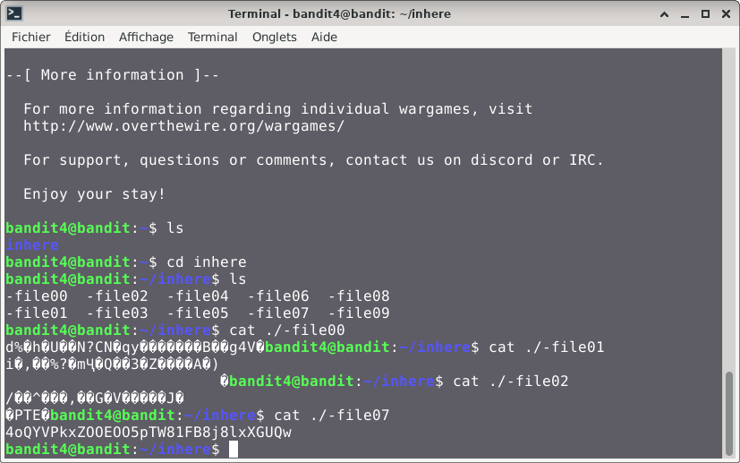

# Bandit — Niveau 4 → 5

## 📌 Informations
- **Plateforme :** OverTheWire
- **Série :** Bandit
- **Niveau :** 4 → 5
- **Difficulté :** Débutant
- **Date :** 09/06/2026

---

## 🎯 Objectif
le mot de passe du niveau suivant est stocké dans le seul fichier lisible du répertoire inhere

---

## 🔍 Réflexion avant de commencer
nous allons donc chercher le fichier lisible du répertoire inhere

---

## 🛠️ Commandes utilisées

| Commande | Rôle |
|---|---|
| `ssh` | Se connecter au serveur |
| `ls` | Lister les fichiers |
| `cat` | Lire le contenu d'un fichier |
| `file` | analyser un ou plusieurs fichiers pour en déterminer le type exact |
| `du` | estimer l'espace disque occupé par les fichiers et les répertoires |
| `find` | sert à localiser des fichiers et des répertoires au sein de l'arborescence du système |


---

## 📖 Résolution

### Étape 1 — Connexion au serveur

```bash
ssh bandit4@bandit.labs.overthewire.org -p 2220
```

Le mot de passe utilisé est celui obtenu au niveau 3.

### Étape 2 — Vérifier les fichiers présents

```bash
ls 
```

Résultat :
```
inhere
```

Je vois bien le repertoire `inhere`.

### Étape 3 — 

```bash
cd inhere
```
```bash
ls
```

Résultat :
```
bandit4@bandit:~/inhere$ ls
-file00  -file02  -file04  -file06  -file08
-file01  -file03  -file05  -file07  -file09

```

Le terminal interprète chaque mot comme un fichier séparé.
Exactement ce que j'avais prévu dans ma réflexion.

### Étape 4 — Consulter le contenu de chaque fichier pour trouver celui qi est lisible

```bash
cat ./-file00 
cat ./-file02
.
.
.
cat ./-file07
```

faire pareil pour tous les fichiers jusqu'à trouver le bon fichier lisible

---
## visuel




## 🚩 Flag obtenu
```
4oQYVPkxZOOEOO5pTW81FB8j8lxXGUQw
```
---

## 🔗 Références
- [Page officielle Bandit](https://overthewire.org/wargames/bandit/)
