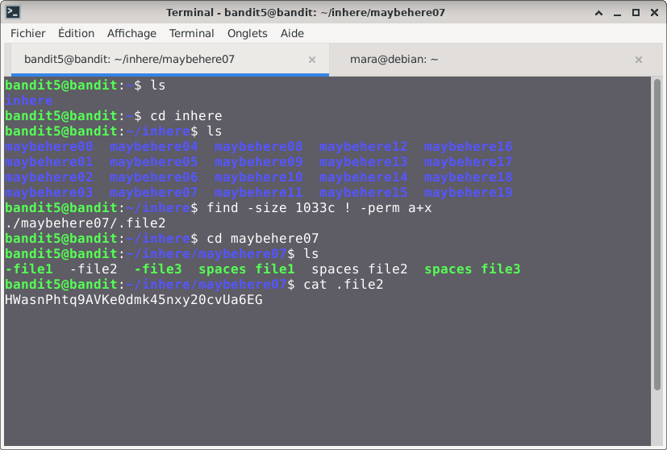

# Bandit — Niveau 5 → 6

## 📌 Informations
- **Plateforme :** OverTheWire
- **Série :** Bandit
- **Niveau :** 5 → 6
- **Difficulté :** Débutant
- **Date :** 09/06/2026

---

## 🎯 Objectif
Le mot de passe pour le niveau suivant est stocké dans un fichier quelque part sous le répertoire `inhere` et possède toutes les propriétés suivantes:

- human-readable
- 1033 bytes in size
- not executable
  


---

## 🔍 Réflexion avant de commencer.  
il s'agit de trouver un fichier avec une taille de 1033 octets et qui n'est pas exécutable

---

## 🛠️ Commandes données en indice

| Commande | Rôle |
|---|---|
| `cd` | permet de naviguer à l'intérieur de l'arborescence des dossiers. |
| `ls` | Lister les fichiers |
| `cat` | Lire le contenu d'un fichier |
| `file` | analyser un ou plusieurs fichiers pour en déterminer le type exact |
| `du` | estimer l'espace disque occupé par les fichiers et les répertoires |
| `find` | sert à localiser des fichiers et des répertoires au sein de l'arborescence du système |

---


## 📖 Résolution

### Étape 1 — Connexion au serveur

```bash
ssh bandit5@bandit.labs.overthewire.org -p 2220
```

Le mot de passe utilisé est celui obtenu au niveau precedent.

### Étape 2 — Vérifier les fichiers présents

```bash
ls 
```

Résultat :
```
inhere

```
```bash
cd inhere
```
```bash
ls
```
Résultat :
```

bandit5@bandit:~/inhere$ ls
maybehere00  maybehere04  maybehere08  maybehere12  maybehere16
maybehere01  maybehere05  maybehere09  maybehere13  maybehere17
maybehere02  maybehere06  maybehere10  maybehere14  maybehere18
maybehere03  maybehere07  maybehere11  maybehere15  maybehere19
```

Je vois bien le fichier `-` dans le repertoire.

### Étape 3 — nous allons utiliser la commande find
#### comprendre la commande 
**Syntaxe de base**: `find <chemin> <option>`
##### Attributs de ls commande find  utile dans le challenge  
**-size** : Recherche par aille  
- c : octets (bytes)  
- k : kilo-octets (Ko)  
- M : méga-octets (Mo)  
- G : giga-octets (Go)  
- `+` : supérieur à la taille spécifiée  
- `-` : inférieur à la taille spécifiée    
Exemples :  
Trouver les fichiers pesant exactement 10 Mo :  
```bash
find . -size 10M  
```
**-perm**: Recherche par permission  
Exemple:  
Trouver tous les fichiers exécutables (+x) dans un répertoire :find . -perm /a+x   
**!** : donne la negation de l'attribut qui vient ensuite

```bash
find -size 1033c ! -perm a+x
```  
### ou
```bash
find -size 1033c ! -perm +x 
```

Résultat :  
```
bandit5@bandit:~/inhere/maybehere07$ cat .file2  

HWasnPhtq9AVKe0dmk45nxy20cvUa6EG
```

## Visuel


## 🚩 Flag obtenu
```
HWasnPhtq9AVKe0dmk45nxy20cvUa6EG
```

---

## 💡 Ce que j'ai appris  
  
  
La commande find sous Linux est un outil qui permet de chercher instantanément des fichiers précis en se basant sur des critères essentiels comme: l'attribut -size filtre les éléments selon leur poids ou espace disque occupé, tandis que l'attribut -perm cible les fichiers selon leurs droits d'accès et d'exécution.

---

## 🔗 Références
- [Page officielle Bandit](https://overthewire.org/wargames/bandit/)