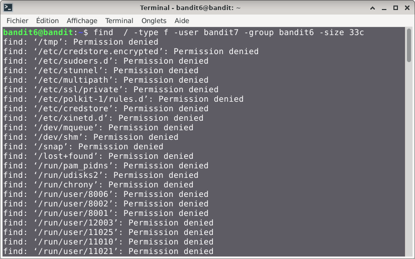
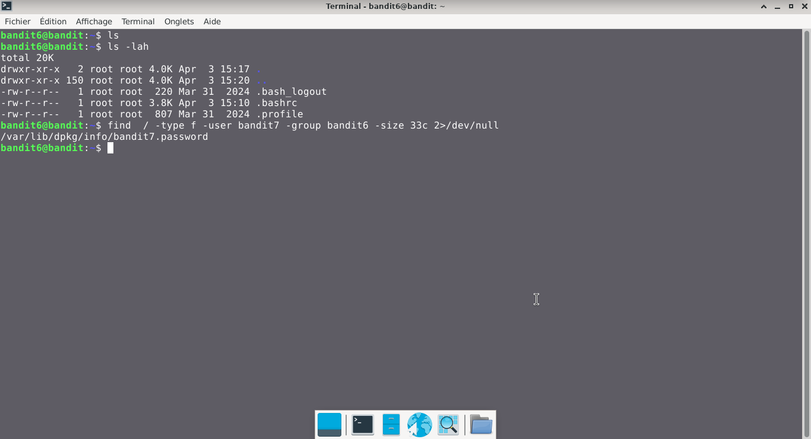

# Bandit — Niveau 6 → 7

## 📌 Informations
- **Plateforme :** OverTheWire
- **Série :** Bandit
- **Niveau :** 6 → 7
- **Difficulté :** Débutant
- **Date :** 10/06/2026

---

## 🎯 Objectif
Le mot de passe pour le niveau suivant est stocké quelque part sur le serveur et a toutes les propriétés suivantes:  

    propriété de l'utilisateur bandit7
    propriété du groupe bandit6
    33 octets de taille

---

## 🔍 Réflexion avant de commencer.  
le but est donc de chercher un fichier sur le serveur ayant les propriétés listées

---

## 🛠️ Commandes données en indice

| Commande | Rôle |
|---|---|
| `cd` | permet de naviguer à l'intérieur de l'arborescence des dossiers. |
| `ls` | Lister les fichiers |
| `cat` | Lire le contenu d'un fichier |
| `file` | analyser un ou plusieurs fichiers pour en déterminer le type exact |
| `du` | estimer l'espace disque occupé par les fichiers et les répertoires |
| `find` | sert à localiser des fichiers et des répertoires au sein de l'arborescence du système |

---


## 📖 Résolution

### Étape 1 — Connexion au serveur

```bash
ssh bandit6@bandit.labs.overthewire.org -p 2220
```

Le mot de passe utilisé est celui obtenu au niveau 6.

### Étape 2 — Vérifier les fichiers présents

```bash
ls 
```

Résultat :
```

```
```bash
ls -lah
```
Résultat :  
```  
bandit6@bandit:~$ ls -lah
total 20K
drwxr-xr-x   2 root root 4.0K Apr  3 15:17 .
drwxr-xr-x 150 root root 4.0K Apr  3 15:20 ..
-rw-r--r--   1 root root  220 Mar 31  2024 .bash_logout
-rw-r--r--   1 root root 3.8K Apr  3 15:10 .bashrc
-rw-r--r--   1 root root  807 Mar 31  2024 .profile
```

### Étape 3 — chercher le fichier en question

```bash
find  / -type f -user bandit7 -group bandit6 -size 33c 
```

Résultat :

  


#### Deuxième tentatives

```bash
find  / -type f -user bandit7 -group bandit6 -size 33c 2>/dev/null
```

Résultat :
```
/var/lib/dpkg/info/bandit7.password
```
## Visuel
  
```bash
cat /var/lib/dpkg/info/bandit7.password  
```  
Résultat :
```
morbNTDkSW6jIlUc0ymOdMaLnOlFVAaj  
```
## 🚩 Flag obtenu
```
morbNTDkSW6jIlUc0ymOdMaLnOlFVAaj
```

---

## 💡 Ce que j'ai appris  

la syntaxe `2>/dev/null` est utilisée pour masquer et supprimer les messages d'erreur générés par une commande
  
  ---

## 🔗 Références
- [Page officielle Bandit](https://overthewire.org/wargames/bandit/)