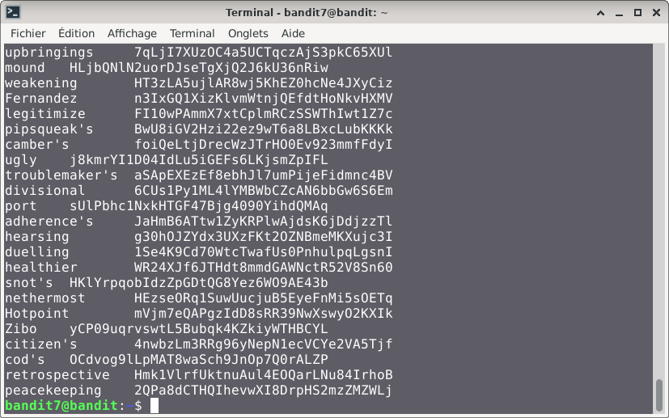
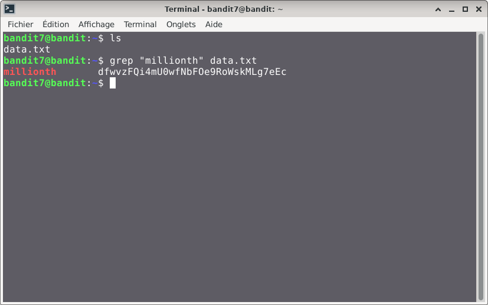

# Bandit — Niveau 7 → 8

## 📌 Informations
- **Plateforme :** OverTheWire
- **Série :** Bandit
- **Niveau :** 7 → 8
- **Difficulté :** Débutant
- **Date :** 10/06/2026

---

## 🎯 Objectif
Le mot de passe pour le niveau suivant est stocké dans le fichier data.txt à côté du mot `millionth`
---

## 🔍 Réflexion avant de commencer.  
nous devons trouver un moyen de retrouver le mot `millionth` dans le fichier.

---

## 🛠️ Commandes données en indice

| Commande | Rôle |
|---|---|
| `man` | Permet de consulter la documentation d'une commande spécifique, il suffit de saisir man suivi du nom de la commande |
| `grep` | La commande grep sous Linux permet de rechercher des motifs dans un texte. |
| `sort` | la commande `sort` trie le contenu des fichiers ou des flux de données texte, ligne par ligne. |
| `uniq` | Permet de filtrer les lignes répétées d'un fichier texte ou d'une entrée standard. |
| `strings` | Permet de rechercher et d'extraire des séquences de caractères lisibles (texte) dans des fichiers binaires ou des exécutables. |
| `find` | sert à localiser des fichiers et des répertoires au sein de l'arborescence du système |

---


## 📖 Résolution

### Étape 1 — Connexion au serveur

```bash
ssh bandit7@bandit.labs.overthewire.org -p 2220
```

Le mot de passe utilisé est celui obtenu au niveau 6 → 7.

### Étape 2 — Vérifier les fichiers présents

```bash
ls 
```

Résultat :
```

data.txt
```


### Étape 3 — je vais lire le contenu du fichier avec cat
#### première tentative

```bash
cat data.txt
```

Résultat :

## Visuel

#### Deuxième tentatives

```bash
grep "millionth" data.txt
```

Résultat :
```
bandit7@bandit:~$ grep "millionth" data.txt
millionth	dfwvzFQi4mU0wfNbFOe9RoWskMLg7eEc
```
## Visuel

## 🚩 Flag obtenu
```
dfwvzFQi4mU0wfNbFOe9RoWskMLg7eEc
```

---

## 💡 Ce que j'ai appris
la commande grep permet de retrouver des informations dans un fichier de façon automatique.

---

## 🔗 Références
- [Page officielle Bandit](https://overthewire.org/wargames/bandit/)