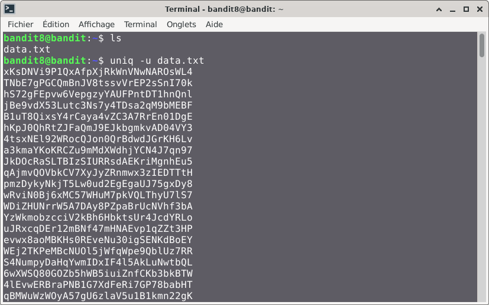
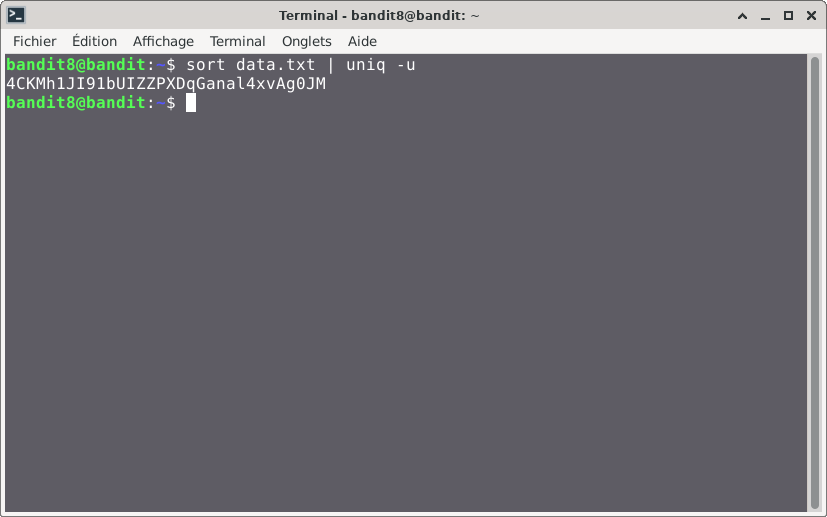

# Bandit — Niveau 8 → 9

## 📌 Informations
- **Plateforme :** OverTheWire
- **Série :** Bandit
- **Niveau :** 8 → 9
- **Difficulté :** Débutant
- **Date :** 10/06/2026

---

## 🎯 Objectif
Le mot de passe pour le niveau suivant est stocké dans le fichier data.txt et est la seule ligne de texte qui ne se produit qu'une seule fois
---

## 🔍 Réflexion avant de commencer.  
nous devons trouver un moyen de trier le fichier de sorte à sortir uniquement la ligne qui est unique

---

## 🛠️ Commandes données en indice

| Commande | Rôle |
|---|---|
| `man` | Permet de consulter la documentation d'une commande spécifique, il suffit de saisir man suivi du nom de la commande |
| `grep` | La commande grep sous Linux permet de rechercher des motifs dans un texte. |
| `sort` | la commande `sort` trie le contenu des fichiers ou des flux de données texte, ligne par ligne. |
| `uniq` | Permet de filtrer les lignes répétées d'un fichier texte ou d'une entrée standard. |
| `strings` | Permet de rechercher et d'extraire des séquences de caractères lisibles (texte) dans des fichiers binaires ou des exécutables. |
| `find` | sert à localiser des fichiers et des répertoires au sein de l'arborescence du système |

---


## 📖 Résolution

### Étape 1 — Connexion au serveur

```bash
ssh bandit8@bandit.labs.overthewire.org -p 2220
```

Le mot de passe utilisé est celui obtenu au niveau 7 → 8.

### Étape 2 — Vérifier les fichiers présents

```bash
ls 
```

Résultat :
```

data.txt
```


### Étape 3 
#### première tentative

```bash
sort -u data.txt
```


## Visuel

#### Deuxième tentatives

```bash
uniq -u data.txt
```
## Visuel  
  
### Troisième tentative  
```bash
sort data.txt | uniq -u
```

Résultat :
```
bandit8@bandit:~$ sort data.txt | uniq -u
4CKMh1JI91bUIZZPXDqGanal4xvAg0JM
```
## Visuel

## 🚩 Flag obtenu
```
4CKMh1JI91bUIZZPXDqGanal4xvAg0JM
```

---

## 💡 Ce que j'ai appris
uniq ne supprime que les doublons adjacents. Si un même élément apparaît au début et à la fin d'un fichier sans être directement collé l'un à l'autre, uniq ne le détectera pas.Il est donc courant de l'associer à la commande sort à l'aide d'un pipe (|) pour trier le fichier au préalable :sort fichier.txt | uniq

---

## 🔗 Références
- [Page officielle Bandit](https://overthewire.org/wargames/bandit/)