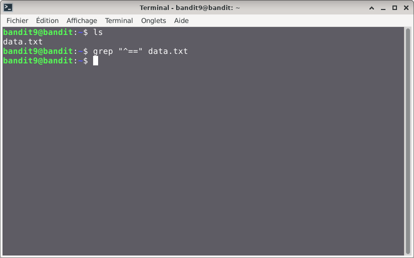
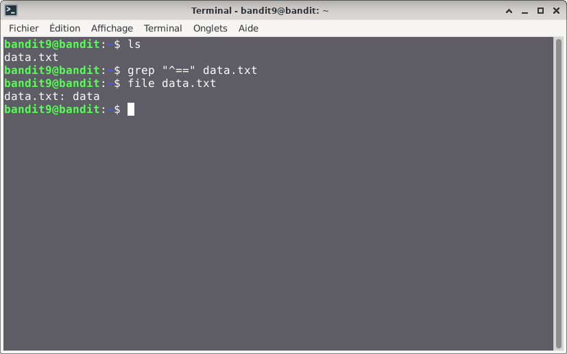
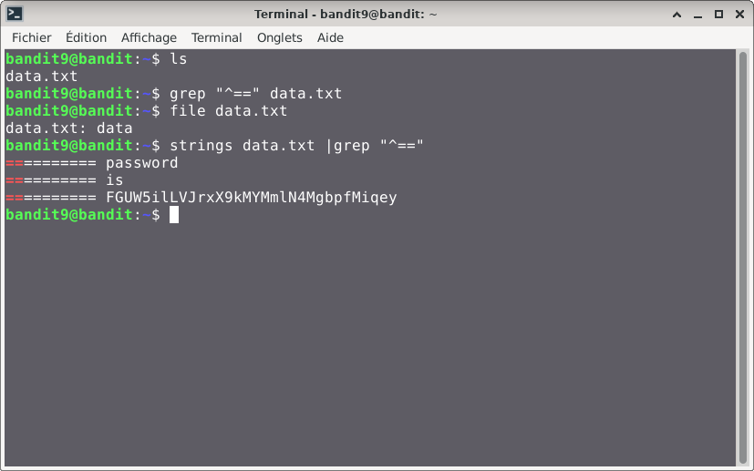

# Bandit — Niveau 9 → 10

## 📌 Informations
- **Plateforme :** OverTheWire
- **Série :** Bandit
- **Niveau :** 9 → 10
- **Difficulté :** Débutant
- **Date :** 10/06/2026

---

## 🎯 Objectif.  
Le mot de passe pour le niveau suivant est stocké dans le fichier data.txt dans l’une des rares chaînes lisibles par l’homme, précédée de plusieurs « = » .
  
  ---

## 🔍 Réflexion avant de commencer.  
nous devons trouver un moyen de trier le fichier de sorte à sortir uniquement la ligne précédée de plusieurs « = » .

---

## 🛠️ Commandes données en indice

| Commande | Rôle |
|---|---|
| `man` | Permet de consulter la documentation d'une commande spécifique, il suffit de saisir man suivi du nom de la commande |
| `grep` | La commande grep sous Linux permet de rechercher des motifs dans un texte. |
| `sort` | la commande `sort` trie le contenu des fichiers ou des flux de données texte, ligne par ligne. |
| `uniq` | Permet de filtrer les lignes répétées d'un fichier texte ou d'une entrée standard. |
| `strings` | Permet de rechercher et d'extraire des séquences de caractères lisibles (texte) dans des fichiers binaires ou des exécutables. |
| `find` | sert à localiser des fichiers et des répertoires au sein de l'arborescence du système |

---


## 📖 Résolution

### Étape 1 — Connexion au serveur

```bash
ssh bandit9@bandit.labs.overthewire.org -p 2220
```

Le mot de passe utilisé est celui obtenu au niveau 8 → 9.

### Étape 2 — Vérifier les fichiers présents

```bash
ls 
```

Résultat :
```

data.txt
```


### Étape 3 
#### première tentative

```bash
grep "^==" data.txt
```
**^**: permet de dire que  la ligne ext précédée par ce aui suit

## Visuel

#### type du fichier

```bash
file data.txt
```
## Visuel  
  
le fichier est donc bimaire  
### Troisième tentative  
```bash
strings data.txt | grep "^=="
```

Résultat :
```
bandit9@bandit:~$ strings data.txt |grep "^=="
========== password
========== is
========== FGUW5ilLVJrxX9kMYMmlN4MgbpfMiqey
bandit9@bandit:~$ 

```
## Visuel

## 🚩 Flag obtenu
```
FGUW5ilLVJrxX9kMYMmlN4MgbpfMiqey
```

---

## 💡 Ce que j'ai appris.  
la commande `strings` Permet de rechercher et d'extraire des séquences de caractères lisibles (texte) dans un fichier binaire.    

  
---

## 🔗 Références
- [Page officielle Bandit](https://overthewire.org/wargames/bandit/)