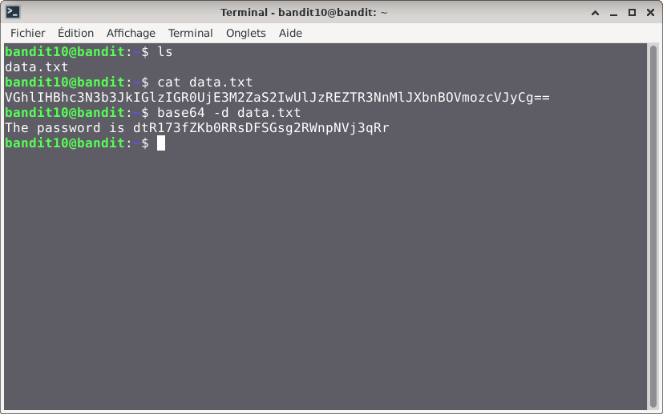

# Bandit — Niveau 10 → 11

## 📌 Informations
- **Plateforme :** OverTheWire
- **Série :** Bandit
- **Niveau :** 10 → 11
- **Difficulté :** Débutant
- **Date :** 10/06/2026

---

## 🎯 Objectif.  
Le mot de passe pour le niveau suivant est stocké dans le fichier data.txt, qui contient des données codées base64
  
  ---

## 🔍 Réflexion avant de commencer.  
nous devons trouver un moyen de décoder le conteu du fichier data.txt.

---

## 🛠️ Commandes données en indice

| Commande | Rôle |
|---|---|
| `man` | Permet de consulter la documentation d'une commande spécifique, il suffit de saisir man suivi du nom de la commande |
| `grep` | La commande grep sous Linux permet de rechercher des motifs dans un texte. |
| `sort` | la commande `sort` trie le contenu des fichiers ou des flux de données texte, ligne par ligne. |
| `uniq` | Permet de filtrer les lignes répétées d'un fichier texte ou d'une entrée standard. |
| `strings` | Permet de rechercher et d'extraire des séquences de caractères lisibles (texte) dans des fichiers binaires ou des exécutables. |
| `base64` | Base64 est un système de codage utilisé pour convertir des données binaires en format texte en les encodant en une représentation en base 64.|

---


## 📖 Résolution

### Étape 1 — Connexion au serveur

```bash
ssh bandit10@bandit.labs.overthewire.org -p 2220
```

Le mot de passe utilisé est celui obtenu au niveau 9 → 10.

### Étape 2 — Vérifier les fichiers présents

```bash
ls 
```

Résultat :
```

data.txt
```


### Étape 3 — 
#### première tentative

```bash
base64 -d data.txt
```
**-d**: permet de décoder


Résultat :
```
bandit10@bandit:~$ base64 -d data.txt
The password is dtR173fZKb0RRsDFSGsg2RWnpNVj3qRr

```
## Visuel

## 🚩 Flag obtenu
```
dtR173fZKb0RRsDFSGsg2RWnpNVj3qRr
```

---

## 💡 Ce que j'ai appris.  
la commande `base64` permet d'encoder et de décoder  le contenu d'un fichier.

  
---

## 🔗 Références
- [Page officielle Bandit](https://overthewire.org/wargames/bandit/)