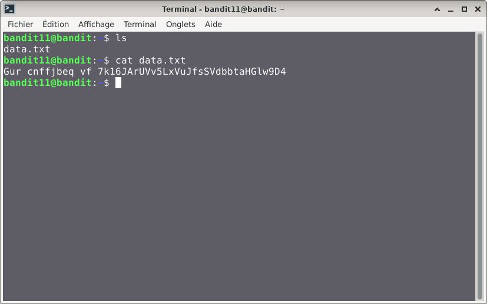
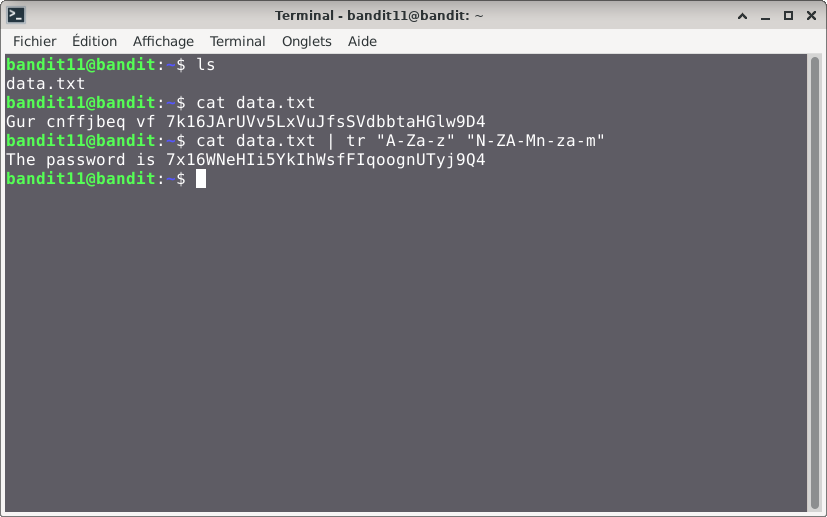

# Bandit — Niveau 11 → 12

## 📌 Informations
- **Plateforme :** OverTheWire
- **Série :** Bandit
- **Niveau :** 11 → 12
- **Difficulté :** Débutant
- **Date :** 19/06/2026

---

## 🎯 Objectif.  
Le mot de passe pour le niveau suivant est stocké dans le fichier data.txt, où toutes les lettres minuscules (a-z) et majuscules (A-Z) ont été permutées à 13 positions.
  
  ---

## 🔍 Réflexion avant de commencer.  
nous devons trouver un moyen de décoder le conteu du fichier data.txt.

---

## 🛠️ Commandes données en indice

| Commande | Rôle |
|---|---|
| `man` | Permet de consulter la documentation d'une commande spécifique, il suffit de saisir man suivi du nom de la commande |
| `tr` | permet de traduire, remplacer ou supprimer des caractères dans un flux de texte reçu via l'entrée standard. |
| `sort` | la commande `sort` trie le contenu des fichiers ou des flux de données texte, ligne par ligne. |
| `uniq` | Permet de filtrer les lignes répétées d'un fichier texte ou d'une entrée standard. |
| `strings` | Permet de rechercher et d'extraire des séquences de caractères lisibles (texte) dans des fichiers binaires ou des exécutables. |
| `base64` | Base64 est un système de codage utilisé pour convertir des données binaires en format texte en les encodant en une représentation en base 64.|

---


## 📖 Résolution

### Étape 1 — Connexion au serveur

```bash
ssh bandit11@bandit.labs.overthewire.org -p 2220
```

Le mot de passe utilisé est celui obtenu au niveau précédent .

### Étape 2 — Vérifier les fichiers présents

```bash
ls 
```

Résultat :
```

data.txt
```


### Étape 3 — 
#### première tentative

```bash
cat data.txt
```


Résultat :
```
Gur cnffjbeq vf 7k16JArUVv5LxVuJfsSVdbbtaHGlw9D4

```
## Visuel
  

####  deuxième tentative  
```bash
cat data.txt | tr "A-Za-z" "N-ZA-Mn-za-m"
```  
Résultat :  
```
The password is 7x16WNeHIi5YkIhWsfFIqoognUTyj9Q4
```  
## visuel  
 
## 🚩 Flag obtenu
```
7x16WNeHIi5YkIhWsfFIqoognUTyj9Q4
```  


---

## 💡 Ce que j'ai appris.  
La commande tr est un outil en ligne de commande Unix conçu pour filtrer le texte en remplaçant, supprimant ou compressant des caractères spécifiques issus de l'entrée standard.

  
---

## 🔗 Références
- [Page officielle Bandit](https://overthewire.org/wargames/bandit/)