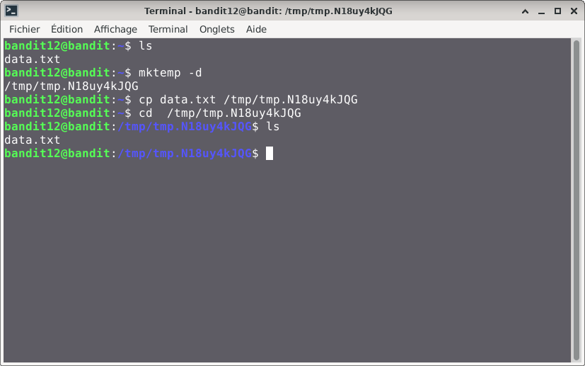
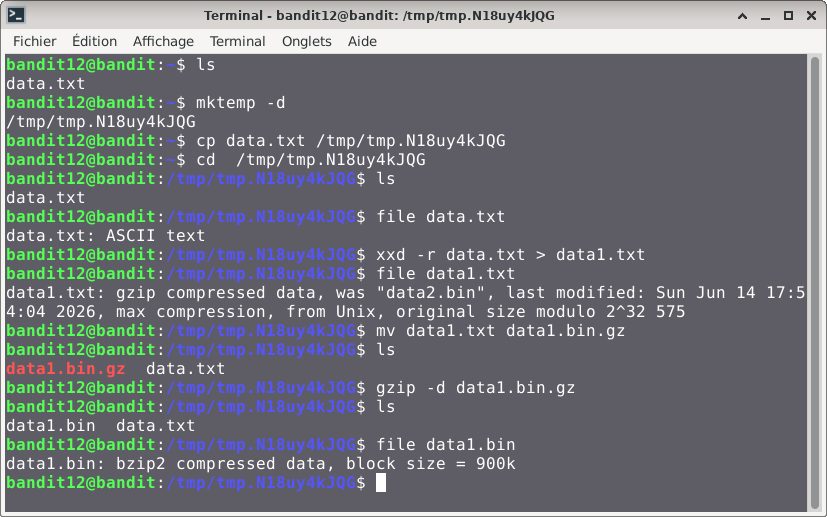
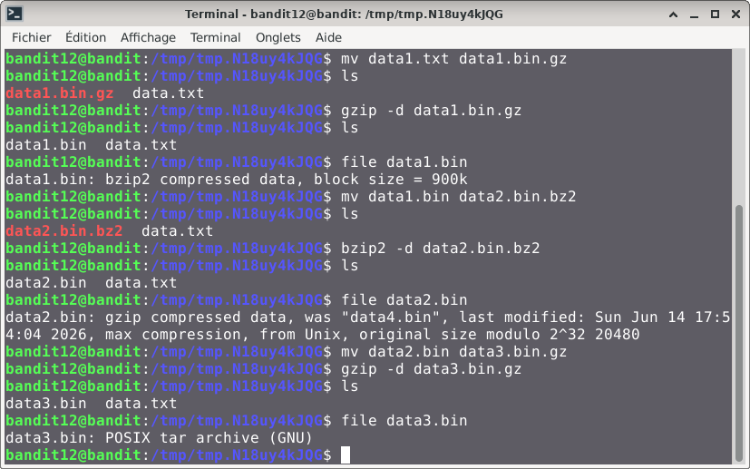
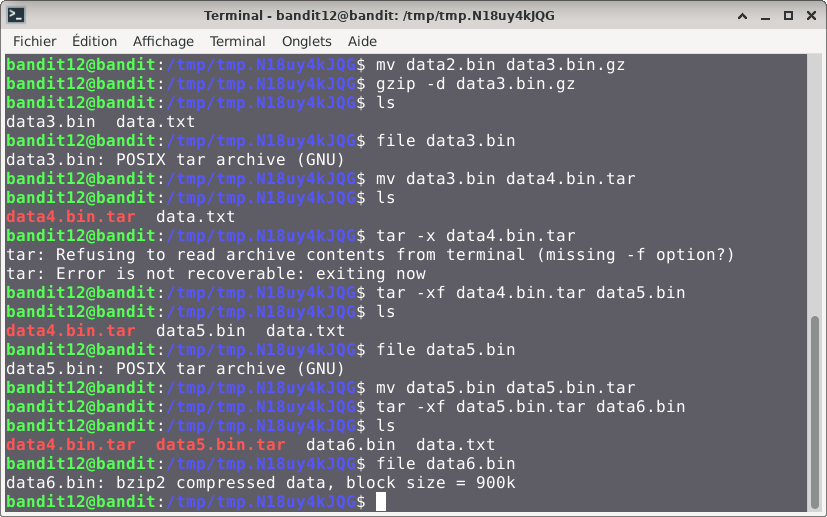
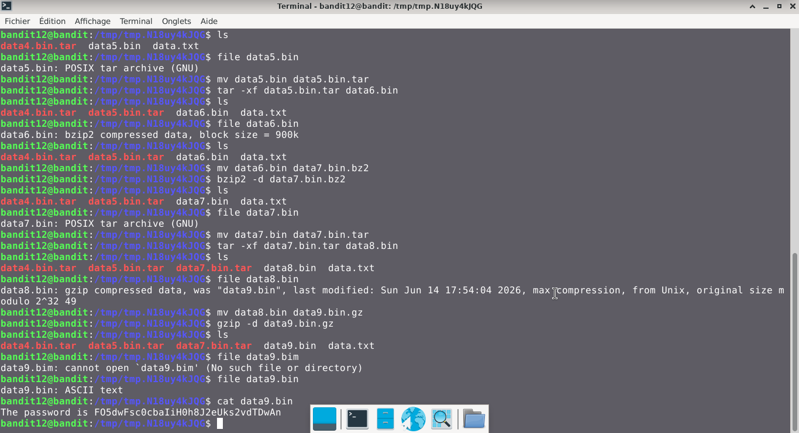

# Bandit — Niveau 12 → 13

## 📌 Informations
- **Plateforme :** OverTheWire
- **Série :** Bandit
- **Niveau :** 12 → 13
- **Difficulté :** Débutant
- **Date :** 19/06/2026

---

## 🎯 Objectif.  
Le mot de passe du niveau suivant est stocké dans le fichier data.txt, qui est un hexdump d’un fichier compressé à plusieurs reprises.
  
  ---

## 🔍 Réflexion avant de commencer.  
nous devons trouver un moyen de décoder le conteu du fichier data.txt.

---

## 🛠️ Commandes données en indice

| Commande | Rôle |
|---|---|
| `man` | Permet de consulter la documentation d'une commande spécifique, il suffit de saisir man suivi du nom de la commande |
| `xxd` | permet de créer une représentation hexadécimale (ou "dump") à partir d'un fichier binaire ou de l'entrée standard. |
| `gzip` | sert à réduire la taille d’un fichier pour optimiser l’espace de stockage et accélérer les transferts sur les réseaux. |
| `bzip2` | permet de compresser des fichiers individuels avec un très haut taux de réduction. |
| `tar` |  est l'utilitaire de référence sous Linux et les systèmes Unix pour regrouper plusieurs fichiers et répertoires en une seule archive . |
| `base64` | Base64 est un système de codage utilisé pour convertir des données binaires en format texte en les encodant en une représentation en base 64.|

---


## 📖 Résolution

### Étape 1 — Connexion au serveur

```bash
ssh bandit12@bandit.labs.overthewire.org -p 2220
```

Le mot de passe utilisé est celui obtenu au niveau précédent .

### Étape 2 — Vérifier les fichiers présents

```bash
ls 
```

Résultat :
```

data.txt
```


### Étape 3 — 
#### 1

```bash
mktemp -d
cp data.txt /tmp/tmp.N18uy4kJQG  
cd /tmp/tmp.N18uy4kJQG
```  
## visuel  


```bash  
file data.txt
```  
Résultat :
```
data.txt: ASCII text

```
## Visuel
    
#### 1  
```bash
xxd -r data.txt > data1.txt
file data1.txt
```  
Résultat :  
```
data1.txt: gzip compressed data, was "data2.bin", last modified: Sun Jun 14 17:54:04 2026, max compression, from Unix, original size modulo 2^32 575
``` 
#### 2   
```bash
mv data1.txt data1.bin.gz
ls
gzip -d data1.bin.gz 
ls
```    
`J'ai renommé le fichier en ajoutant l'extension gz car c'est le format utilisé par les fichiers grip. il est donc nécessaire d'ajouter cette extension pour pouvoir mieux manipuler le fichier avec Gzip`
#### visuel   
 
  
### 3 
```bash 
file data1.bin  
```   
Résultat :   
```
data1.bin: bzip2 compressed data, block size = 900k

```  
```bash  
mv data1.bin data2.bin.bz2
bzip2 -d data2.bin.bz2
ls
file data2.bin

```  
Résultat :  
```
data2.bin: gzip compressed data, was "data4.bin", last modified: Sun Jun 14 17:54:04 2026, max compression, from Unix, original size modulo 2^32 20480
```  
```bash  
mv data2.bin data3.bin.gz  
gzip -d data3.bin.gz
ls
file data3.bin  
```
Résultat :  
```
data3.bin: POSIX tar archive (GNU)
```
#### visuel  
    
### 4  
```bash  
mv data3.bin data4.bin.tar
ls
tar -xf data4.bin.tar data5.bin
ls
file data5.bin
```  
Résultat :  
```
data5.bin: POSIX tar archive (GNU)  
```
```bash   
mv data5.bin data5.bin.tar
ls
tar -xf data5.bin.tar data6.bin
ls
file data6.bin
```  
Résultat :  
```
data6.bin: bzip2 compressed data, block size = 900k
```   
### visuel  
  

####  continuer le processus jusqu'à obtenir un fichier ASCII text


```bash
file data9.bin
```  
Résultat :  
```
data9.bin: ASCII text
```    
```bash  
cat data9.bin  
```  
Résultat :  
```
The password is FO5dwFsc0cbaIiH0h8J2eUks2vdTDwAn
```
## visuel  
 
## 🚩 Flag obtenu
```
FO5dwFsc0cbaIiH0h8J2eUks2vdTDwAn
```  


  
---

## 🔗 Références
- [Page officielle Bandit](https://overthewire.org/wargames/bandit/)