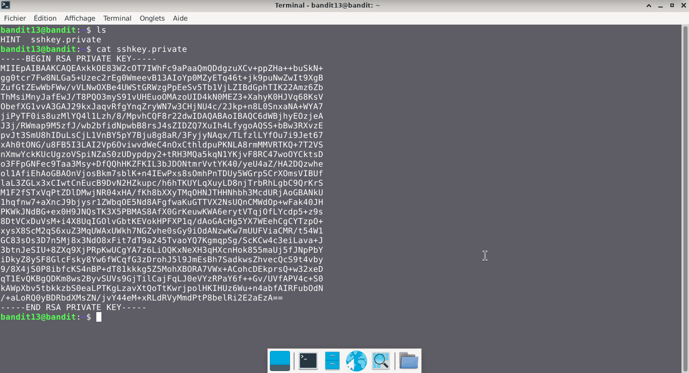
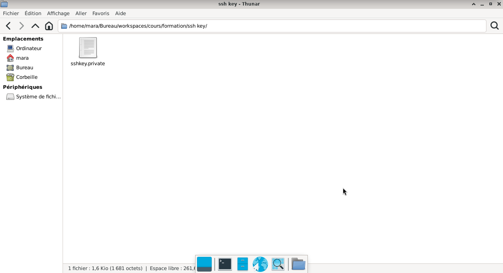
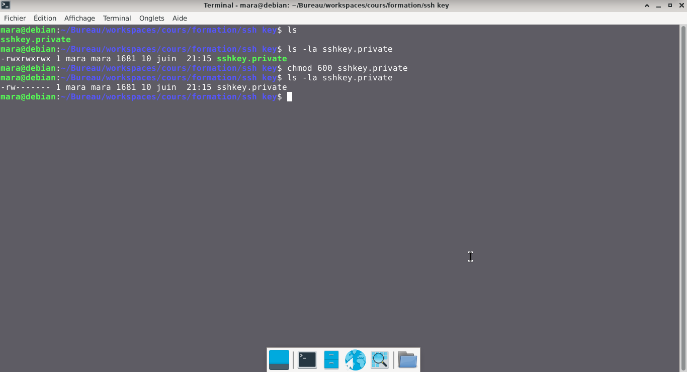

# Bandit — Niveau 13 → 14

## 📌 Informations
- **Plateforme :** OverTheWire
- **Série :** Bandit
- **Niveau :** 13 → 14
- **Difficulté :** Débutant
- **Date :** 20/06/2026

---

## 🎯 Objectif.  
Le mot de passe pour le niveau suivant est stocké dans /etc/bandit_pass/bandit14 et ne peut être lu que par l’utilisateur bandit14.
  
  ---

## 🔍 Réflexion avant de commencer.  
Il est impératif de trouver la clé SSH privée.

---

## 🛠️ Commandes données en indice

| Commande | Rôle |
|---|---|
| `man` | Permet de consulter la documentation d'une commande spécifique, il suffit de saisir man suivi du nom de la commande |
| `tr` | permet de traduire, remplacer ou supprimer des caractères dans un flux de texte reçu via l'entrée standard. |
| `sort` | la commande `sort` trie le contenu des fichiers ou des flux de données texte, ligne par ligne. |
| `uniq` | Permet de filtrer les lignes répétées d'un fichier texte ou d'une entrée standard. |
| `strings` | Permet de rechercher et d'extraire des séquences de caractères lisibles (texte) dans des fichiers binaires ou des exécutables. |
| `base64` | Base64 est un système de codage utilisé pour convertir des données binaires en format texte en les encodant en une représentation en base 64.|

---


## 📖 Résolution

### Étape 1 — Connexion au serveur

```bash
ssh bandit13@bandit.labs.overthewire.org -p 2220
```

Le mot de passe utilisé est celui obtenu au niveau précédent .

### Étape 2 — Vérifier les fichiers présents

```bash
ls 
```

Résultat :
```

HINT  sshkey.private
```


### Étape 3 — 
#### première tentative

```bash
cat sshkey.private
```


Résultat :
```
[Clé privée retirée pour des raisons de sécurité]
```   
### Remarque:  
Nous avons constaté que le fichier sshkey.private contient une clé privée car elle commence par BEGIN RSA PRIVATE KEY
## Visuel
  

####  suite  


nous allons à présent copier le contenu de cette clé privée dans un fichier pour pouvoir nous connecter au niveau suivant de bandit, sachant que nous devons d'abord donner les permissions nécessaires à cette clé pour fonctionner
### visuel  
  
### Gestion des permission  
**Raison :**  Essayez sans les permissions et vous verrez que ça ne marchera pas, la clé que vous devez utiliser doit être privée et donc avoir des permissions strictes.  
```bash  
ls -la sshkey.private
chmod 600 sshkey.private  
ls -la sshkey.private
```    
Résultat :  
```
-rw------- 1 mara mara 1681 10 juin  21:15 sshkey.private
```  
## visuel  
 
  


## 🔗 Références
- [Page officielle Bandit](https://overthewire.org/wargames/bandit/)
