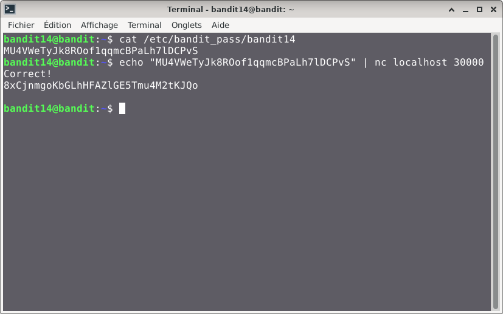

# Bandit — Niveau 14 → 15

## 📌 Informations
- **Plateforme :** OverTheWire
- **Série :** Bandit
- **Niveau :** 14 → 15
- **Difficulté :** Débutant
- **Date :** 20/06/2026

---

## 🎯 Objectif.  
Le mot de passe pour le niveau suivant peut être récupéré en soumettant le mot de passe du niveau actuel au port 30000 sur localhost.
  
  ---

## 🔍 Réflexion avant de commencer.  
nous allons trouver un moyen de  réussir à envoyer le mot de passe sur le port en question via Localhost

---

## 🛠️ Commandes données en indice

| Commande | Rôle |
|---|---|
| `man` | Permet de consulter la documentation d'une commande spécifique, il suffit de saisir man suivi du nom de la commande |
| `nc` | permet de lire et d'écrire des données à travers le réseau en utilisant les protocoles TCP ou UDP. |
| `sort` | la commande `sort` trie le contenu des fichiers ou des flux de données texte, ligne par ligne. |
| `uniq` | Permet de filtrer les lignes répétées d'un fichier texte ou d'une entrée standard. |
| `strings` | Permet de rechercher et d'extraire des séquences de caractères lisibles (texte) dans des fichiers binaires ou des exécutables. |
| `base64` | Base64 est un système de codage utilisé pour convertir des données binaires en format texte en les encodant en une représentation en base 64.|

---


## 📖 Résolution

### Étape 1 — Connexion au serveur

```bash
ssh -i sshkey.private bandit14@bandit.labs.overthewire.org -p 2220
```
**Remarque :** rappelez-vous qu'une clé SSH a été obtenue au niveau précédent et nous allons l'utiliser pour pour nous connecter à ce niveau en utilisant l'attribut `-i`qui nous permet de spécifier une clé privée pour assurer la connexion.  


### Étape 2 — Trouvons le mot de passe du niveau 14  
Nous savons que c'est dans le fichier `/etc/bandit_pass/bnadit14`


```bash
cat /etc/bandit_pass/bnadit14

```
Résultat :  
```
MU4VWeTyJk8ROof1qqmcBPaLh7lDCPvS  
```

### Étape 3 — 
#### première tentative

**Syntaxe de base nc :** nc [options] [adresse_hôte] [port(s)]

```bash
echo "MU4VWeTyJk8ROof1qqmcBPaLh7lDCPvS" | nc localhost 30000
```


Résultat :
```  
Correct!
8xCjnmgoKbGLhHFAZlGE5Tmu4M2tKJQo
```
## Visuel
  


## 🚩 Flag obtenu
```
8xCjnmgoKbGLhHFAZlGE5Tmu4M2tKJQo
```  


---

## 💡 Ce que j'ai appris.  
En utilisant `nc` pour envoyer ce mot de pqsse, nous avons  agi comme un client réseau brut pour valider la connectivité et interagir directement avec un service distant sans intermédiaire.

  
---

## 🔗 Références
- [Page officielle Bandit](https://overthewire.org/wargames/bandit/)