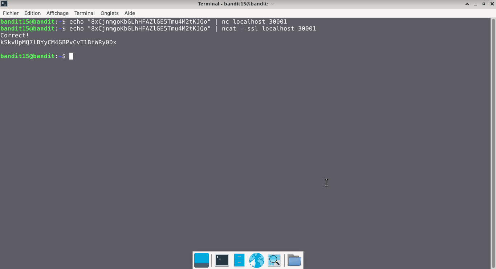

# Bandit — Niveau 15 → 16

## 📌 Informations
- **Plateforme :** OverTheWire
- **Série :** Bandit
- **Niveau :** 15 → 16
- **Difficulté :** Débutant
- **Date :** 20/06/2026

---

## 🎯 Objectif.  
Le mot de passe pour le niveau suivant peut être récupéré en soumettant le mot de passe du niveau actuel au port 30001 sur localhost en utilisant le cryptage SSL/TLS.
  
  ---

## 🔍 Réflexion avant de commencer.  
nous allons trouver un moyen de  réussir à envoyer le mot de passe sur le port en question via Localhost  en utilisant le cryptage SSL/TLS.


---

## 🛠️ Commandes données en indice

| Commande | Rôle |
|---|---|
| `man` | Permet de consulter la documentation d'une commande spécifique, il suffit de saisir man suivi du nom de la commande |
| `nc` | permet de lire et d'écrire des données à travers le réseau en utilisant les protocoles TCP ou UDP.|
| `ncat` | permet de lire et d'écrire des données à travers le réseau en utilisant les protocoles TCP ou UDP. |
| `uniq` | Permet de filtrer les lignes répétées d'un fichier texte ou d'une entrée standard. |
| `strings` | Permet de rechercher et d'extraire des séquences de caractères lisibles (texte) dans des fichiers binaires ou des exécutables. |
| `base64` | Base64 est un système de codage utilisé pour convertir des données binaires en format texte en les encodant en une représentation en base 64.|

---


## 📖 Résolution

### Étape 1 — Connexion au serveur

```bash
ssh bandit15@bandit.labs.overthewire.org -p 2220
```

Le mot de passe utilisé est celui obtenu au niveau précédent .

### Étape 2 — 

```bash
echo "8xCjnmgoKbGLhHFAZlGE5Tmu4M2tKJQo" | nc localhost 30001
```

Résultat :
```


```


### Étape 3 — 
#### première tentative

```bash
echo "8xCjnmgoKbGLhHFAZlGE5Tmu4M2tKJQo" | ncat --ssl localhost 30001
```


Résultat :
```
Correct!
kSkvUpMQ7lBYyCM4GBPvCvT1BfWRy0Dx


```
## Visuel
  


## 🚩 Flag obtenu
```
kSkvUpMQ7lBYyCM4GBPvCvT1BfWRy0Dx
```  


---

## 💡 Ce que j'ai appris.  
La commande `ncat` est la version moderne et sécurisée de l'outil historique nc (Netcat) issue du projet Nmap. Son attribut --ssl permet d'établir des connexions chiffrées de bout en bout via les protocoles SSL/TLS pour protéger les données.
  
---

## 🔗 Références
- [Page officielle Bandit](https://overthewire.org/wargames/bandit/)