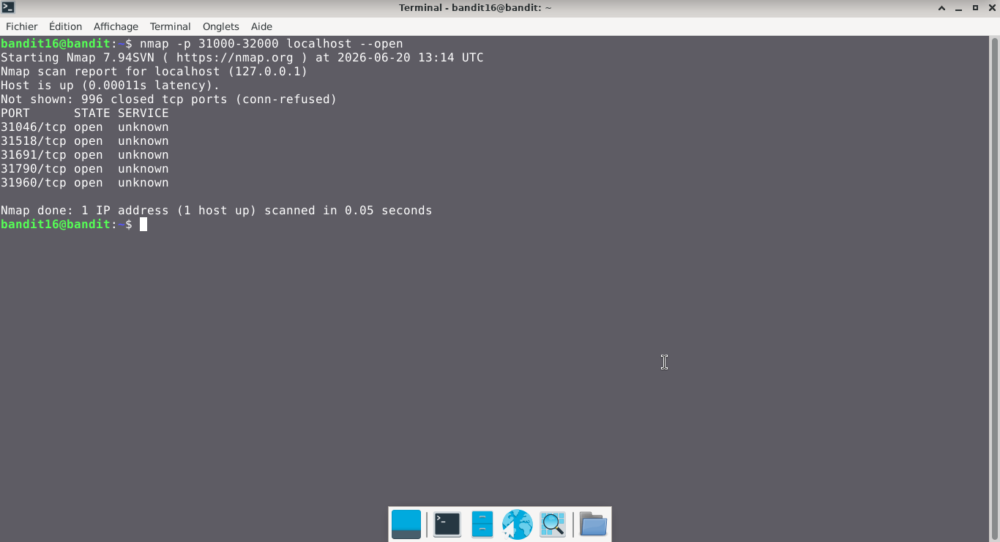
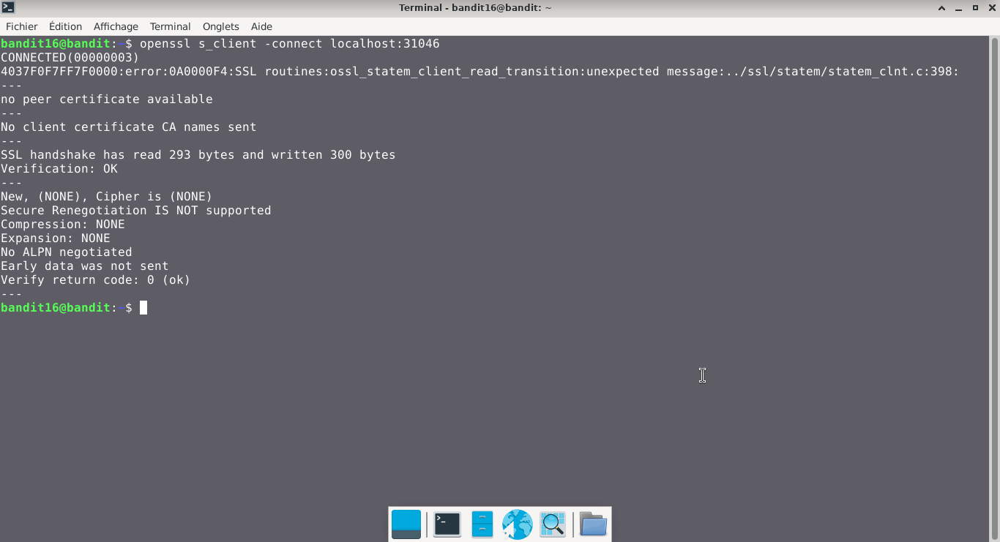
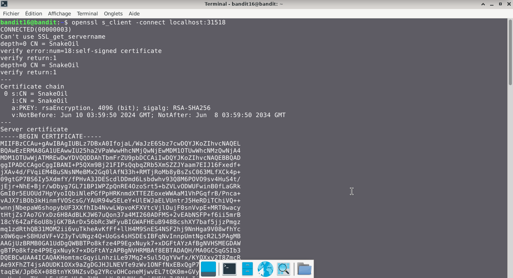
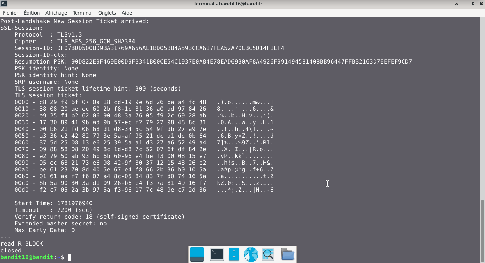
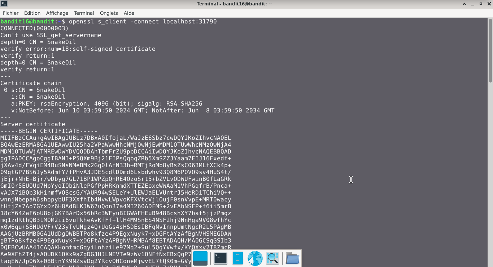
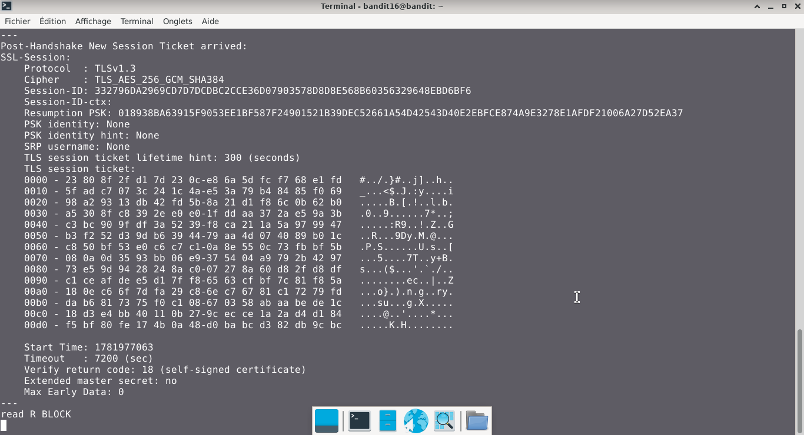
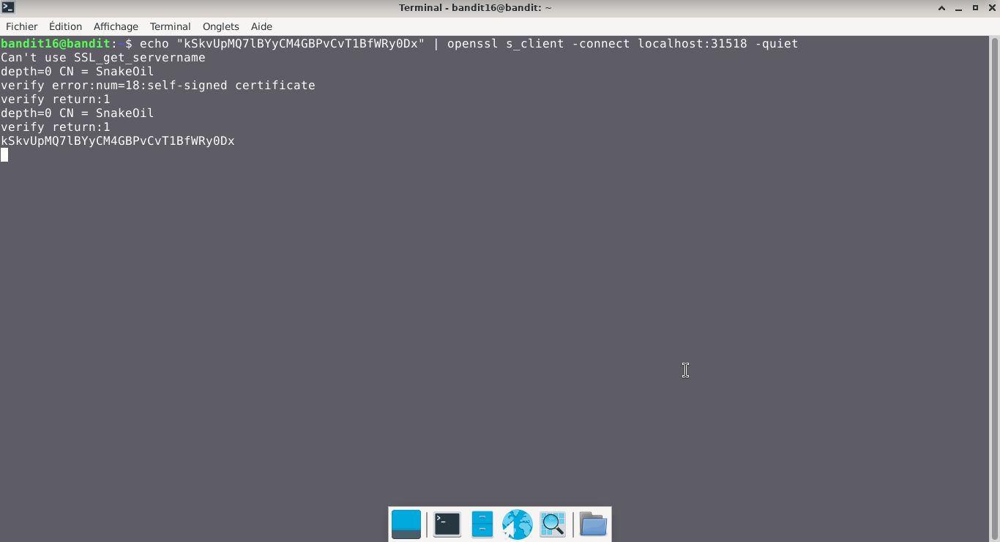
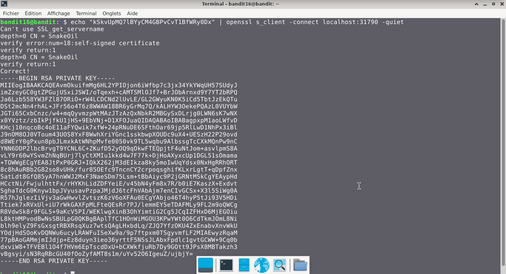

# Bandit — Niveau 16 → 17

## 📌 Informations
- **Plateforme :** OverTheWire
- **Série :** Bandit
- **Niveau :** 16 → 17
- **Difficulté :** Débutant
- **Date :** 20/06/2026

---

## 🎯 Objectif.  
Les identifiants pour le niveau suivant peuvent être récupérés en soumettant le mot de passe du niveau actuel à un port sur localhost dans la plage 31000 à 32000. Découvrez d’abord lesquels de ces ports ont un serveur qui les écoute. Ensuite, déterminez lesquels d’entre eux parlent SSL/TLS et lesquels ne le font pas. Il n’y a qu’un seul serveur qui donnera les identifiants suivants, les autres vous renverront simplement tout ce que vous leur envoyez.
  
  ---

## 🔍 Réflexion avant de commencer.  
nous allons trouver un moyen de  réussir à envoyer le mot de passe sur les ports en question via Localhost.


---

## 🛠️ Commandes données en indice

| Commande | Rôle |
|---|---|
| `man` | Permet de consulter la documentation d'une commande spécifique, il suffit de saisir man suivi du nom de la commande |
| `nc` | permet de lire et d'écrire des données à travers le réseau en utilisant les protocoles TCP ou UDP.|
| `ncat` | permet de lire et d'écrire des données à travers le réseau en utilisant les protocoles TCP ou UDP. |
| `openssl s_client` |  est un client SSL/TLS générique servant d'outil de diagnostic. Elle permet d'établir une connexion réseau chiffrée avec un serveur distant. |
| `nmap` |  Son rôle est de cartographier des réseaux, détecter les hôtes actifs, identifier les ports ouverts, déterminer les services (et leurs versions) et profiler les systèmes d'exploitation. |
| `base64` | Base64 est un système de codage utilisé pour convertir des données binaires en format texte en les encodant en une représentation en base 64.|

---


## 📖 Résolution

### Étape 1 — Connexion au serveur

```bash
ssh bandit16@bandit.labs.overthewire.org -p 2220
```

Le mot de passe utilisé est celui obtenu au niveau précédent .

### Étape 2 — Ports ouverts

```bash
nmap -p 31000-32000 localhost -open
```

Résultat :
```
Nmap scan report for localhost (127.0.0.1)
Host is up (0.00014s latency).
Not shown: 996 closed tcp ports (conn-refused)
PORT      STATE SERVICE
31046/tcp open  unknown
31518/tcp open  unknown
31691/tcp open  unknown
31790/tcp open  unknown
31960/tcp open  unknown


```  
- nous avons trouvé des ports ouverts en écoute dans cette plage d'adresses
### visuel  


### Étape 3 — 
#### vérifions si les ports répondent au protocole SSL/TLS  
### Port 31046

```bash
openssl s_client -connect localhost:31046
```

## Visuel
  

### Port 31518

```bash
openssl s_client -connect localhost:31518
```

## Visuel
   
 

### Port 31691

```bash
openssl s_client -connect localhost:31691
```  

## Visuel
  


### Port 31790

```bash
openssl s_client -connect localhost:31790
```

## Visuel
    
  


### Port 31960

```bash
openssl s_client -connect localhost:31960
```

## Visuel
  
    

**REMARQUE :** nous constatons que deux ports répondent au protocole SSL/TLS     (31518 et 31790)   

### Étape 4 —  trouvons le bon port  
```bash  
echo "kSkvUpMQ7lBYyCM4GBPvCvT1BfWRy0Dx" | openssl s_client -connect localhost:31518 -quiet
```  
### visuel
  
**REMARQUE :** malgré l'envoi du mot de passe, la session reste ouverte et attend un mot de passe, donc ce n'est pas le bon port qui doit nous renvoyer le mot de passe du niveau suivant après avoir reçu le mot de passe du niveau précédent
  
```bash  
echo "kSkvUpMQ7lBYyCM4GBPvCvT1BfWRy0Dx" | openssl s_client -connect localhost:31790 -quiet
```  
### visuel



## 🚩 Flag obtenu
```
[Clé privée retirée pour des raisons de sécurité]
```  


---

## 💡 Ce que j'ai appris.  
ce qui a attiré le plus mon attention, c'est l'attribut -quiet qui maintient la connexion à la machine le temps de recevoir le mot de passe. Sinon, sans cet attribut, la session se ferme bien avant le retour du mot de passe, bien que le mot de passe du niveau précédent envoyé soit le bon
---

## 🔗 Références
- [Page officielle Bandit](https://overthewire.org/wargames/bandit/)