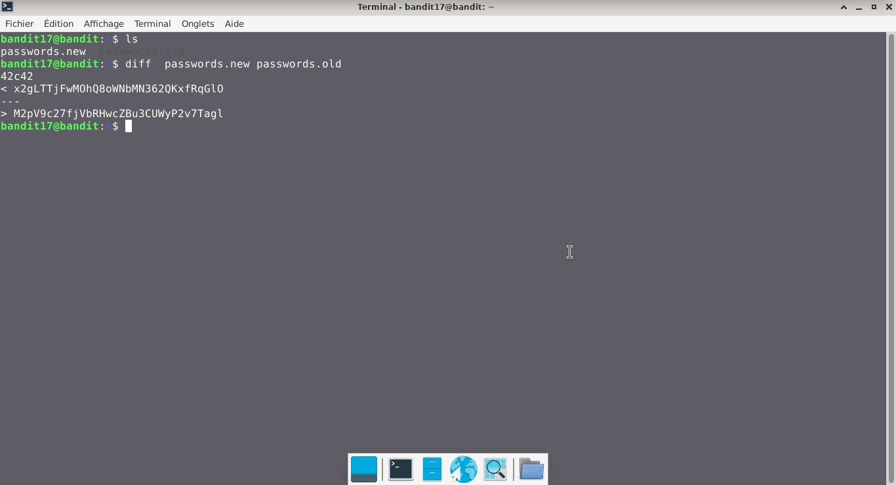

# Bandit — Niveau 17 → 18

## 📌 Informations
- **Plateforme :** OverTheWire
- **Série :** Bandit
- **Niveau :** 17 → 18
- **Difficulté :** Débutant
- **Date :** 20/06/2026

---

## 🎯 Objectif.  
Il y a 2 fichiers dans le répertoire personnel : passwords.old et passwords.new. Le mot de passe pour le niveau suivant se trouve dans passwords.new et c’est la seule ligne qui a été modifiée entre passwords.old et passwords.new

  ---

## 🔍 Réflexion avant de commencer.  
nous devons trouver un moyen de comparer les deux fichiers pour trouver le mot de passe


---

## 🛠️ Commandes données en indice

| Commande | Rôle |
|---|---|
| `man` | Permet de consulter la documentation d'une commande spécifique, il suffit de saisir man suivi du nom de la commande |
| `diff` | permet de comparer deux fichiers texte ligne par ligne.|
| `ncat` | permet de lire et d'écrire des données à travers le réseau en utilisant les protocoles TCP ou UDP. |
| `uniq` | Permet de filtrer les lignes répétées d'un fichier texte ou d'une entrée standard. |
| `strings` | Permet de rechercher et d'extraire des séquences de caractères lisibles (texte) dans des fichiers binaires ou des exécutables. |
| `base64` | Base64 est un système de codage utilisé pour convertir des données binaires en format texte en les encodant en une représentation en base 64.|

---


## 📖 Résolution

### Étape 1 — Connexion au serveur

```bash
ssh -i rsakey.private bandit17@bandit.labs.overthewire.org -p 2220
```


### Étape 2 — 

```bash
ls
```

Résultat :
```
passwords.new passwords.old

```


### Étape 3 — 
#### première tentative

```bash
diff passwords.new passwords.old
```


Résultat :
```
42c42
< x2gLTTjFwMOhQ8oWNbMN362QKxfRqGlO
---
> M2pV9c27fjVbRHwcZBu3CUWyP2v7Tagl


```
## Visuel
  


## 🚩 Flag obtenu
```
x2gLTTjFwMOhQ8oWNbMN362QKxfRqGlO
```  


---

## 💡 Ce que j'ai appris.  
La commande `diff` permet de comparer deux fichiers texte ligne par ligne
  
---

## 🔗 Références
- [Page officielle Bandit](https://overthewire.org/wargames/bandit/)