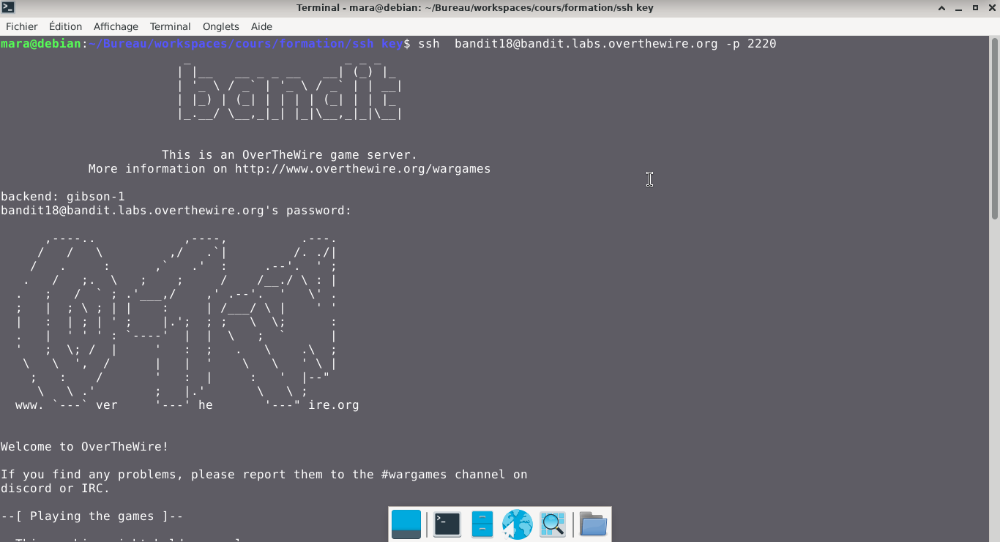
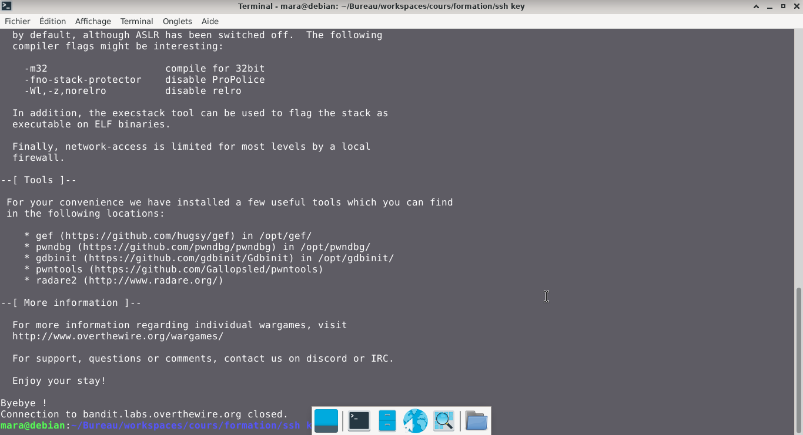
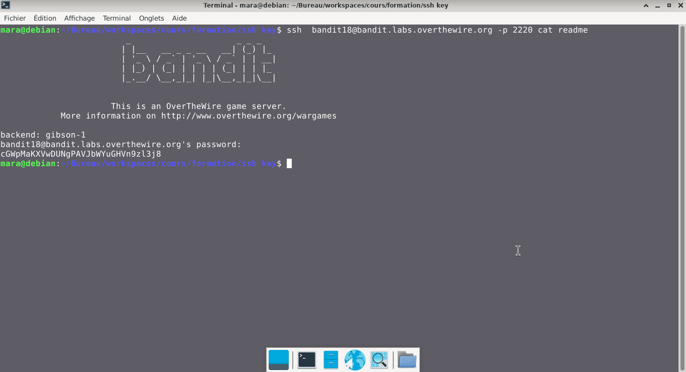

# Bandit — Niveau 18 → 19

## 📌 Informations
- **Plateforme :** OverTheWire
- **Série :** Bandit
- **Niveau :** 18 → 19
- **Difficulté :** Débutant
- **Date :** 20/06/2026

---

## 🎯 Objectif.  
Le mot de passe pour le niveau suivant est stocké dans un fichier readme dans le répertoire personnel. Malheureusement, quelqu’un a modifié . bashrc pour vous déconnecter lorsque vous vous connectez avec SSH.

  ---

## 🔍 Réflexion avant de commencer.  
nous devons trouver un moyen de lire le fichier readme avant que la session ne se ferme


---

## 🛠️ Commandes données en indice

| Commande | Rôle |
|---|---|
| `man` | Permet de consulter la documentation d'une commande spécifique, il suffit de saisir man suivi du nom de la commande |
| `diff` | permet de comparer deux fichiers texte ligne par ligne.|
| `ncat` | permet de lire et d'écrire des données à travers le réseau en utilisant les protocoles TCP ou UDP. |
| `uniq` | Permet de filtrer les lignes répétées d'un fichier texte ou d'une entrée standard. |
| `strings` | Permet de rechercher et d'extraire des séquences de caractères lisibles (texte) dans des fichiers binaires ou des exécutables. |
| `base64` | Base64 est un système de codage utilisé pour convertir des données binaires en format texte en les encodant en une représentation en base 64.|

---


## 📖 Résolution

### Étape 1 — Connexion au serveur

```bash
ssh bandit18@bandit.labs.overthewire.org -p 2220
```
### visuel  
  


### Étape 2 — 

```bash
ssh  bandit18@bandit.labs.overthewire.org -p 2220 cat readme
```

Résultat :
```
backend: gibson-1
bandit18@bandit.labs.overthewire.org's password: 
cGWpMaKXVwDUNgPAVJbWYuGHVn9zl3j8
```

## Visuel
  


## 🚩 Flag obtenu
```
cGWpMaKXVwDUNgPAVJbWYuGHVn9zl3j8
```  

  
---

## 🔗 Références
- [Page officielle Bandit](https://overthewire.org/wargames/bandit/)