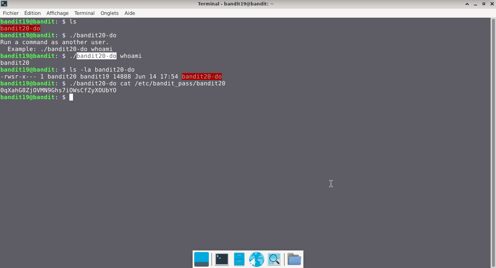

# Bandit — Niveau 19 → 20

## 📌 Informations
- **Plateforme :** OverTheWire
- **Série :** Bandit
- **Niveau :** 19 → 20
- **Difficulté :** Débutant
- **Date :** 20/06/2026

---

## 🎯 Objectif.  
Pour accéder au niveau suivant, vous devez utiliser le binaire setuid dans le répertoire personnel. Exécutez-le sans arguments pour savoir comment l’utiliser. Le mot de passe pour ce niveau peut être trouvé à l’endroit habituel ( /etc/bandit_pass), après avoir utilisé le binaire setuid.

  ---

## 🔍 Réflexion avant de commencer.  
trouvons un moyen d'utiliser le binaire setuid


---

## 🛠️ Commandes données en indice

| Commande | Rôle |
|---|---|
| `man` | Permet de consulter la documentation d'une commande spécifique, il suffit de saisir man suivi du nom de la commande |
| `diff` | permet de comparer deux fichiers texte ligne par ligne.|
| `ncat` | permet de lire et d'écrire des données à travers le réseau en utilisant les protocoles TCP ou UDP. |
| `uniq` | Permet de filtrer les lignes répétées d'un fichier texte ou d'une entrée standard. |
| `strings` | Permet de rechercher et d'extraire des séquences de caractères lisibles (texte) dans des fichiers binaires ou des exécutables. |
| `base64` | Base64 est un système de codage utilisé pour convertir des données binaires en format texte en les encodant en une représentation en base 64.|

---


## 📖 Résolution

### Étape 1 — Connexion au serveur

```bash
ssh bandit19@bandit.labs.overthewire.org -p 2220
```


### Étape 2 — 

```bash
ls
```

Résultat :
```
bandit20-do

```


### Étape 3 — 
#### première tentative

```bash
./bandit20-do
```

Résultat :
```Run a command as another user.
  Example: ./bandit20-do whoami

```  
```bash  
./bandit20-do whoami
```  
Résultat :  
```
bandit20
```  
```bash  
./bandit20-do cat /etc/bandit_pass/bandit20  
```  
Résultat :  
```
0qXahG8ZjOVMN9Ghs7iOWsCfZyXOUbYO
```
## Visuel
  


## 🚩 Flag obtenu
```
0qXahG8ZjOVMN9Ghs7iOWsCfZyXOUbYO
```  


---

## 💡 Ce que j'ai appris.  
Le mécanisme Setuid (Set User ID) permet à un utilisateur standard d'exécuter un programme avec les privilèges du propriétaire de ce fichier (généralement root). 
  
---

## 🔗 Références
- [Page officielle Bandit](https://overthewire.org/wargames/bandit/)