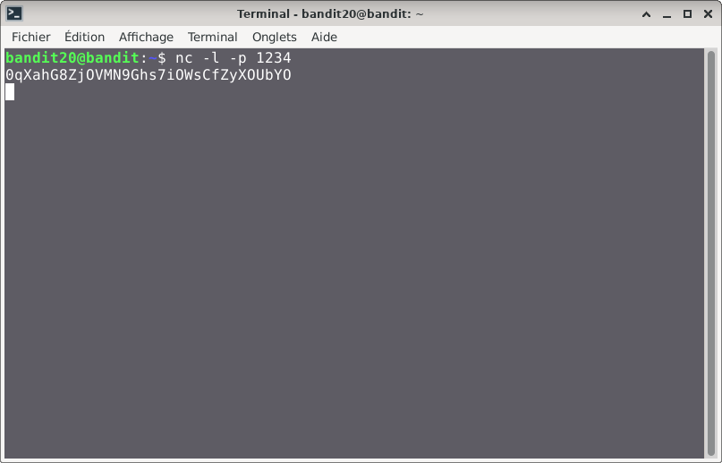
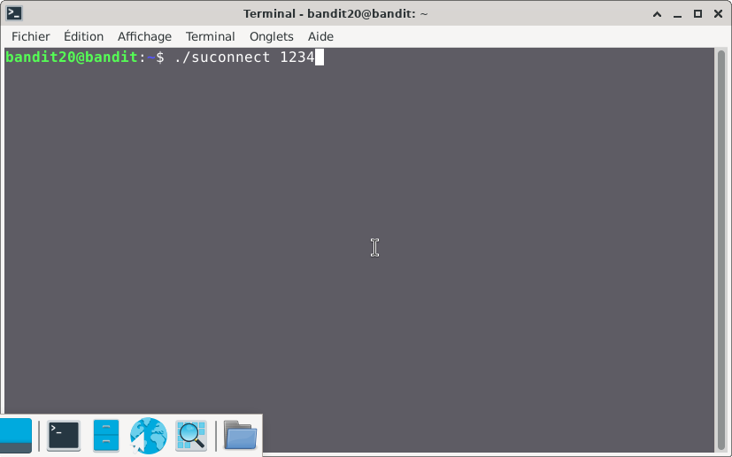
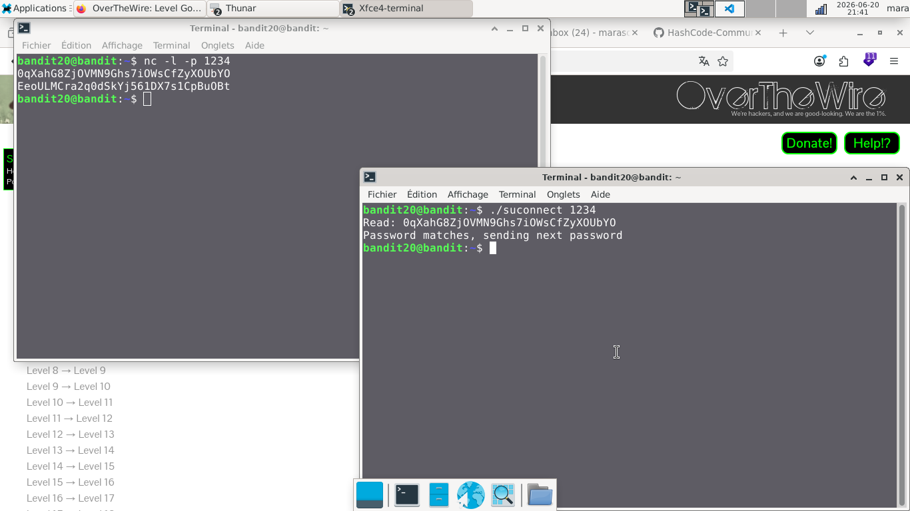

# Bandit — Niveau 20 → 21

## 📌 Informations
- **Plateforme :** OverTheWire
- **Série :** Bandit
- **Niveau :** 20 → 21
- **Difficulté :** Débutant
- **Date :** 20/06/2026

---

## 🎯 Objectif.  
Il y a un binaire setuid dans le répertoire qui fait ce qui suit : il établit une connexion à localhost sur le port que vous spécifiez comme argument de ligne de commande. Il lit ensuite une ligne de texte de la connexion et la compare au mot de passe du niveau précédent (bandit20). Si le mot de passe est correct, il transmettra le mot de passe pour le niveau suivant (bandit21).

  ---

## 🔍 Réflexion avant de commencer.  
trouvons un moyen d'utiliser le binaire setuid


---

## 🛠️ Commandes données en indice

| Commande | Rôle |
|---|---|
| `man` | Permet de consulter la documentation d'une commande spécifique, il suffit de saisir man suivi du nom de la commande |
| `diff` | permet de comparer deux fichiers texte ligne par ligne.|
| `ncat` | permet de lire et d'écrire des données à travers le réseau en utilisant les protocoles TCP ou UDP. |
| `uniq` | Permet de filtrer les lignes répétées d'un fichier texte ou d'une entrée standard. |
| `strings` | Permet de rechercher et d'extraire des séquences de caractères lisibles (texte) dans des fichiers binaires ou des exécutables. |
| `base64` | Base64 est un système de codage utilisé pour convertir des données binaires en format texte en les encodant en une représentation en base 64.|

---


## 📖 Résolution

### Étape 1 — Connexion au serveur

```bash
ssh bandit20@bandit.labs.overthewire.org -p 2220
```


### Étape 2 — 

```bash
ls
```

Résultat :
```
suconnect

```


### Étape 3 — 
#### première tentative

```bash
./suconnect
```

Résultat :
```
Usage: ./suconnect <portnumber>
This program will connect to the given port on localhost using TCP. If it receives the correct password from the other side, the next password is transmitted back.


```  

#### méthode de résolution  
**méthode :** ouvrir deux terminal et se connecter au niveau 20  
### Premier terminal  

```bash  
nc -l -p 1234
0qXahG8ZjOVMN9Ghs7iOWsCfZyXOUbYO

```  
#### visuel 

### second terminal  
```bassh  
./suconnect 1234
```  
#### visuel  

### Fonctionnement  
nous allons donc envoyer le mot de passe du niveau précédent sur le premier terminal, le deuxième terminal va comparer le mot de passe envoyé par le premier avec celui stocké dans la base de données de bandit, si le mot de passe est correct alors le second terminal enverra le mot de passe du niveau suivant au premier terminal
## Visuel
  


## 🚩 Flag obtenu
```
EeoULMCra2q0dSkYj561DX7s1CpBuOBt
```  

  
---

## 🔗 Références
- [Page officielle Bandit](https://overthewire.org/wargames/bandit/)