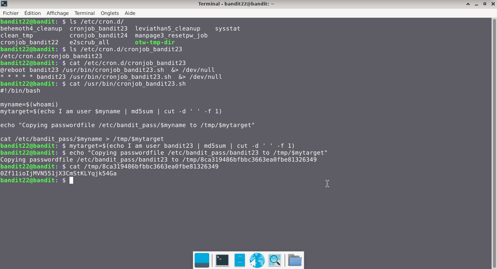

# Bandit — Niveau 22 → 23

## 📌 Informations
- **Plateforme :** OverTheWire
- **Série :** Bandit
- **Niveau :** 22 → 23
- **Difficulté :** Débutant
- **Date :** 20/06/2026

---

## 🎯 Objectif.  
Un programme est exécuté automatiquement à intervalles réguliers depuis cron, le planificateur de tâches basé sur le temps. Regardez dans /etc/cron. d/ pour la configuration et voir quelle commande est en cours d’exécution.  

  ---

## 🔍 Réflexion avant de commencer.  
trouvons un moyen de trouver le mot de passe depuis le programme cron


---

## 🛠️ Commandes données en indice

| Commande | Rôle |
|---|---|
| `man` | Permet de consulter la documentation d'une commande spécifique, il suffit de saisir man suivi du nom de la commande |
| `diff` | permet de comparer deux fichiers texte ligne par ligne.|
| `ncat` | permet de lire et d'écrire des données à travers le réseau en utilisant les protocoles TCP ou UDP. |
| `uniq` | Permet de filtrer les lignes répétées d'un fichier texte ou d'une entrée standard. |
| `strings` | Permet de rechercher et d'extraire des séquences de caractères lisibles (texte) dans des fichiers binaires ou des exécutables. |
| `base64` | Base64 est un système de codage utilisé pour convertir des données binaires en format texte en les encodant en une représentation en base 64.|

---


## 📖 Résolution

### Étape 1 — Connexion au serveur

```bash
ssh bandit22@bandit.labs.overthewire.org -p 2220
```


### Étape 2 — 

```bash
ls /etc/cron.d/
```

Résultat :
```
behemoth4_cleanup  cronjob_bandit23  leviathan5_cleanup    sysstat
clean_tmp          cronjob_bandit24  manpage3_resetpw_job
cronjob_bandit22   e2scrub_all       otw-tmp-dir


```


### Étape 3 — 
#

```bash
cat /etc/cron.d/cronjob_bandit23
```

Résultat :
```
@reboot bandit23 /usr/bin/cronjob_bandit23.sh  &> /dev/null
* * * * * bandit23 /usr/bin/cronjob_bandit23.sh  &> /dev/null


```  
```bash  
cat /usr/bin/cronjob_bandit23.sh
```  
Résultat :  
```
#!/bin/bash

myname=$(whoami)
mytarget=$(echo I am user $myname | md5sum | cut -d ' ' -f 1)

echo "Copying passwordfile /etc/bandit_pass/$myname to /tmp/$mytarget"

```  

```bash  
echo "Copying passwordfile /etc/bandit_pass/bandit23 to /tmp/$mytarget"
```  
Résultat :  
```
Copying passwordfile /etc/bandit_pass/bandit23 to /tmp/8ca319486bfbbc3663ea0fbe81326349
```  
**Remarque :** nous avons remplacé $myname par bandit23 car c'est le mot de passe de bandit23 que nous voulons
```bash
cat /tmp/8ca319486bfbbc3663ea0fbe81326349  
```  
Résultat :  
```  
0Zf11ioIjMVN551jX3CmStKLYqjk54Ga  
```

## Visuel
  


## 🚩 Flag obtenu
```
0Zf11ioIjMVN551jX3CmStKLYqjk54Ga
```  


---

## 💡 Ce que j'ai appris.  
 cron est le planificateur de tâches standard de Linux. Son rôle est d'exécuter automatiquement des scripts, commandes ou programmes en arrière-plan à une date, une heure ou un cycle récurrent défini. L'outil qui permet de configurer ces tâches s'appelle crontab.  

---

## 🔗 Références
- [Page officielle Bandit](https://overthewire.org/wargames/bandit/)