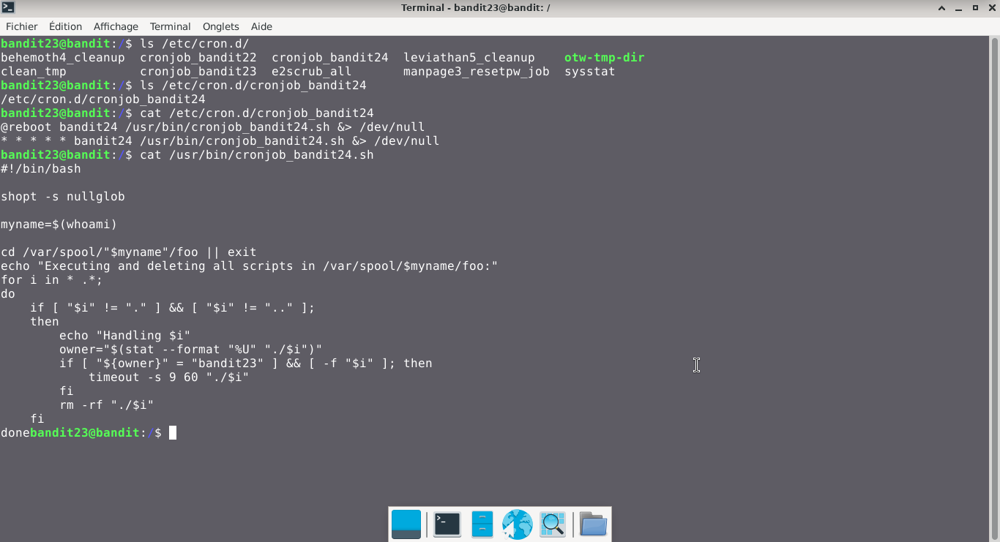
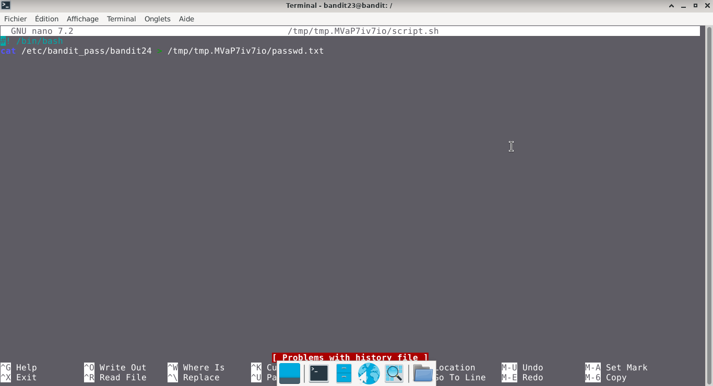
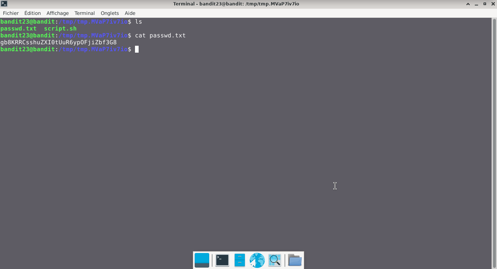

# Bandit — Niveau 23 → 24

## 📌 Informations
- **Plateforme :** OverTheWire
- **Série :** Bandit
- **Niveau :** 23 → 24
- **Difficulté :** Débutant
- **Date :** 21/06/2026

---

## 🎯 Objectif.  
Un programme est exécuté automatiquement à intervalles réguliers depuis cron, le planificateur de tâches basé sur le temps. Regardez dans /etc/cron. d/ pour la configuration et voir quelle commande est en cours d’exécution.  

  ---

## 🔍 Réflexion avant de commencer.  
trouvons un moyen de trouver le mot de passe depuis le programme cron


---

## 🛠️ Commandes données en indice

| Commande | Rôle |
|---|---|
| `man` | Permet de consulter la documentation d'une commande spécifique, il suffit de saisir man suivi du nom de la commande |
| `diff` | permet de comparer deux fichiers texte ligne par ligne.|
| `ncat` | permet de lire et d'écrire des données à travers le réseau en utilisant les protocoles TCP ou UDP. |
| `uniq` | Permet de filtrer les lignes répétées d'un fichier texte ou d'une entrée standard. |
| `strings` | Permet de rechercher et d'extraire des séquences de caractères lisibles (texte) dans des fichiers binaires ou des exécutables. |
| `base64` | Base64 est un système de codage utilisé pour convertir des données binaires en format texte en les encodant en une représentation en base 64.|

---


## 📖 Résolution

### Étape 1 — Connexion au serveur

```bash
ssh bandit23@bandit.labs.overthewire.org -p 2220
```


### Étape 2 — 

```bash
ls /etc/cron.d/
```

Résultat :
```
behemoth4_cleanup  cronjob_bandit23  leviathan5_cleanup    sysstat
clean_tmp          cronjob_bandit24  manpage3_resetpw_job
cronjob_bandit22   e2scrub_all       otw-tmp-dir


```


### Étape 3 — 
#

```bash
cat /etc/cron.d/cronjob_bandit24
```

Résultat :
```
@reboot bandit24 /usr/bin/cronjob_bandit24.sh &> /dev/null
* * * * * bandit24 /usr/bin/cronjob_bandit24.sh &> /dev/null
```  
```bash  
cat /usr/bin/cronjob_bandit24.sh
```  
Résultat :  
```
#!/bin/bash

shopt -s nullglob

myname=$(whoami)

cd /var/spool/"$myname"/foo || exit 
echo "Executing and deleting all scripts in /var/spool/$myname/foo:"
for i in * .*;
do
    if [ "$i" != "." ] && [ "$i" != ".." ];
    then
        echo "Handling $i"
        owner="$(stat --format "%U" "./$i")"
        if [ "${owner}" = "bandit23" ] && [ -f "$i" ]; then
            timeout -s 9 60 "./$i"
        fi
        rm -rf "./$i"
    fi

```  
#### visuel  
  
**Remarque :** nous devons donc créer un script qui pourra récupérer le mot de passe du niveau suivant
```bash  
mktemp -d
```  
Résultat :  
```
/tmp/tmp.lD5YpPwKes
```  
**Remarque :** nous devons donner les droits d'exécution à notre script pour que le programme cron puisse l'exécuter et nous retourner le mot de passe
```bash
touch /tmp/tmp.MVaP7iv7io/script.sh
chmod 777 /tmp/tmp.MVaP7iv7io/script.sh
chmod 777 /tmp/tmp.MVaP7iv7io/
nano /tmp/tmp.MVaP7iv7io/script.sh
```  
### visuel  
  

**Remarque :** dans notre script, nous avons spécifié que le contenu du fichier contenant le mot de passe soit envoyé dans le fichier passwd.txt. Donc, nous allons créer le fichier en question et lui donner les droits pour qu'il puisse être modifié
```bash  
nano /tmp/tmp.MVaP7iv7io/script.sh
touch /tmp/tmp.MVaP7iv7io/passwd.txt
chmod 777 /tmp/tmp.MVaP7iv7io/passwd.txt
cp /tmp/tmp.MVaP7iv7io/script.sh /var/spool/bandit24/foo
cat /tmp/tmp.MVaP7iv7io/passwd.txt
```
**Remarque :** après avoir copier notre script dans /var/spool/bandit24/foo, on attend que le script soit exécuté et nous renvoie le mot de passe
Résultat :  
```  
gb8KRRCsshuZXI0tUuR6ypOFjiZbf3G8 
```

## Visuel
  


## 🚩 Flag obtenu
```
gb8KRRCsshuZXI0tUuR6ypOFjiZbf3G8
```  


---

## 💡 Ce que j'ai appris.  
 cron est le planificateur de tâches standard de Linux. Son rôle est d'exécuter automatiquement des scripts, commandes ou programmes en arrière-plan à une date, une heure ou un cycle récurrent défini. L'outil qui permet de configurer ces tâches s'appelle crontab.  

---

## 🔗 Références
- [Page officielle Bandit](https://overthewire.org/wargames/bandit/)