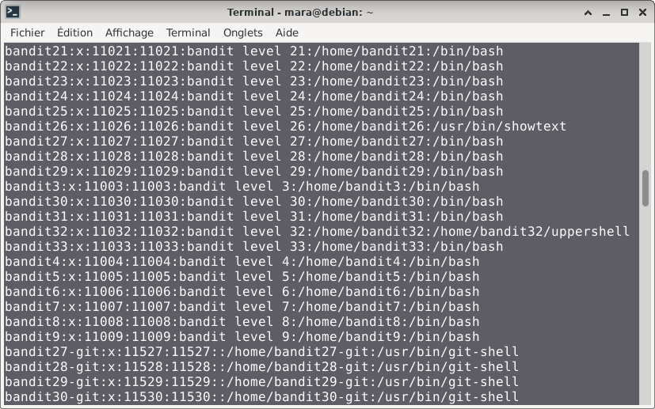
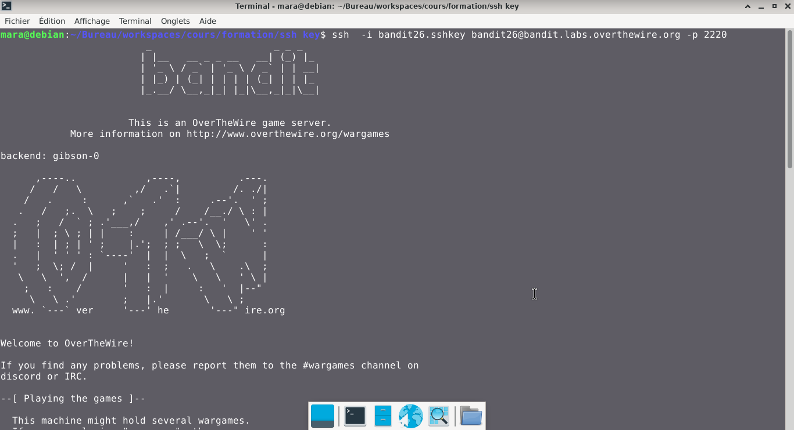
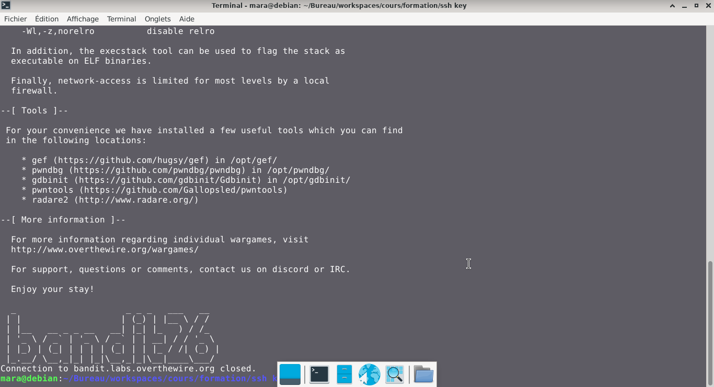
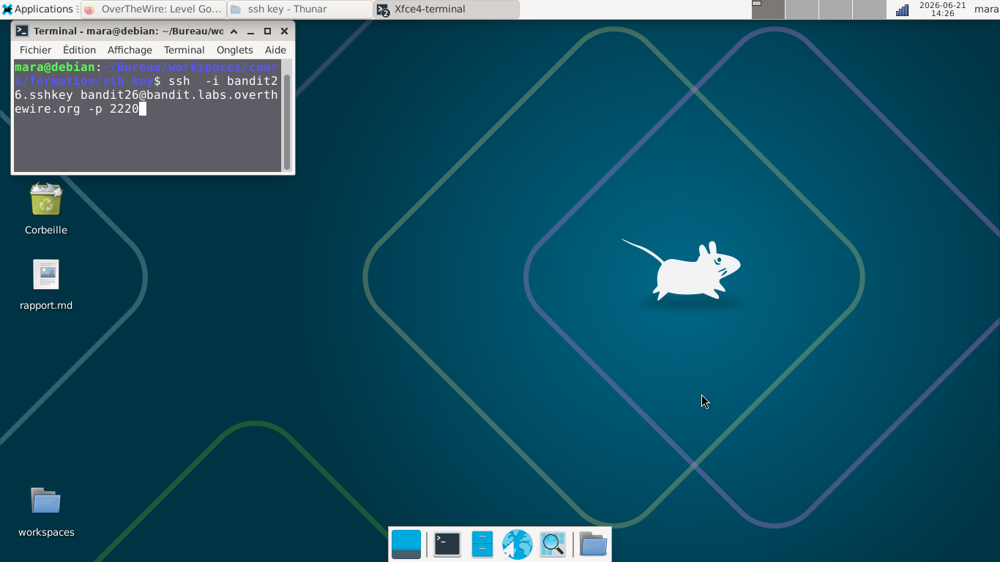
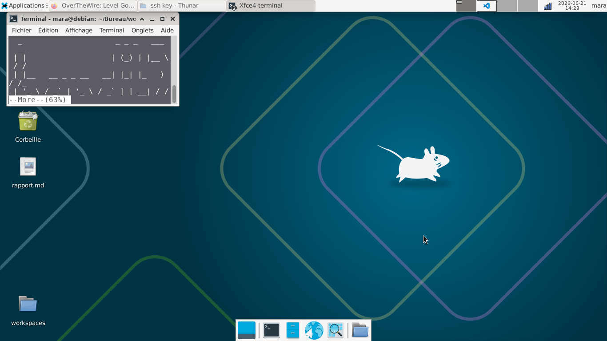
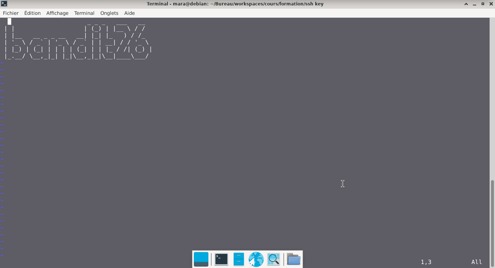
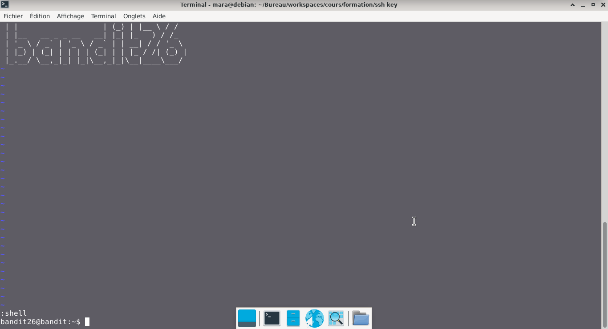
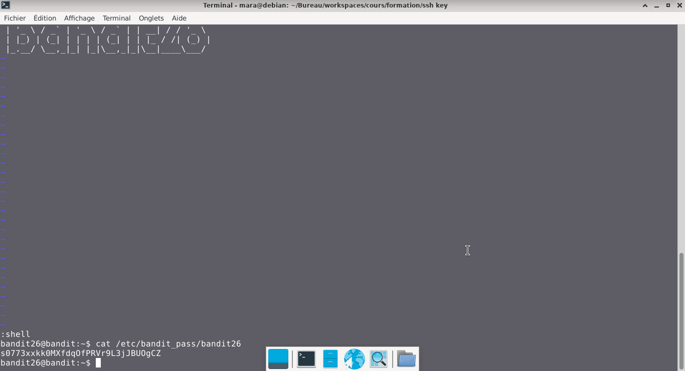

# Bandit — Niveau 25 → 26

## 📌 Informations
- **Plateforme :** OverTheWire
- **Série :** Bandit
- **Niveau :** 25 → 26
- **Difficulté :** Débutant
- **Date :** 21/06/2026

---

## 🎯 Objectif.  
Se connecter à bandit26 depuis bandit25 devrait être assez facile... Le shell de l’utilisateur bandit26 n’est pas /bin/bash, mais autre chose. Découvrez ce que c’est, comment cela fonctionne et comment en sortir.

  ---

## 🔍 Réflexion avant de commencer.  
nous devons trouver le shell utilisé sur la machine bandit26


---

## 🛠️ Commandes données en indice

| Commande | Rôle |
|---|---|
| `man` | Permet de consulter la documentation d'une commande spécifique, il suffit de saisir man suivi du nom de la commande |
| `more` |  permet de visualiser le contenu de fichiers texte ou la sortie de commandes, page par page, directement dans le terminal|
| `vi` |  est l'éditeur de texte universel en mode terminal sous Linux. |
| `uniq` | Permet de filtrer les lignes répétées d'un fichier texte ou d'une entrée standard. |
| `strings` | Permet de rechercher et d'extraire des séquences de caractères lisibles (texte) dans des fichiers binaires ou des exécutables. |
| `base64` | Base64 est un système de codage utilisé pour convertir des données binaires en format texte en les encodant en une représentation en base 64.|

---


## 📖 Résolution

### Étape 1 — Connexion au serveur

```bash
ssh bandit25@bandit.labs.overthewire.org -p 2220
```


### Étape 2 — 

```bash
ls 
```

Résultat :
```
bandit26.sshkey
```


### Étape 3 — 
#

```bash
 cat /etc/passwd
```

Résultat :
  
vérifions quel shell est utilisé
```bash  
cat /usr/bin/showtext
```  
Résultat :  
```
#!/bin/sh

export TERM=linux

exec more ~/text.txt
exit 0


```  
### ouvrir un nouveau terminal et se connecter à bandit26  

```bash  
ssh  -i bandit26.sshkey bandit26@bandit.labs.overthewire.org -p 2220
```  

  
  
- la session se ferme automatiquement après ouverture  
**Remarque :** Elle empêche les longs textes de défiler trop rapidement et affiche le pourcentage de progression en bas de l'écran.  

### commençons à réduire la taille du terminal au maximum.
  


```bash
  ssh  -i bandit26.sshkey bandit26@bandit.labs.overthewire.org -p 2220

```  

####  Appuyez sur la touche v de votre clavier. Cela ouvre le fichier actif dans l'éditeur de texte Vim.  
  
**Spécifier un nouveau Shell :** À l'intérieur de l'éditeur Vim, appuyez sur Echap pour vous assurer d'être en mode commande. Tapez :  
```  
:set shell=/bin/bash 
```  
- appuyez sur la touche `entrer`  
**Lancer le Shell :** Ensuite, lancez le shell en tapant :  
```  
:shell  
```  
- appuyez sur la touche `entrer`  
- nous venons d'obtenir notre shell bash

## Visuel
  
```bash
cat /etc/bandit_pass/bandit26  
```  
Résultat :  
```
s0773xxkk0MXfdqOfPRVr9L3jJBUOgCZ
```  



## 🚩 Flag obtenu
```
s0773xxkk0MXfdqOfPRVr9L3jJBUOgCZ
```  


---

## 💡 Ce que j'ai appris.  
La taille du terminal peut briser une sécurité car elle force un outil statique à basculer en mode interactif, ouvrant ainsi la voie à une élévation de privilèges. 

---

## 🔗 Références
- [Page officielle Bandit](https://overthewire.org/wargames/bandit/)