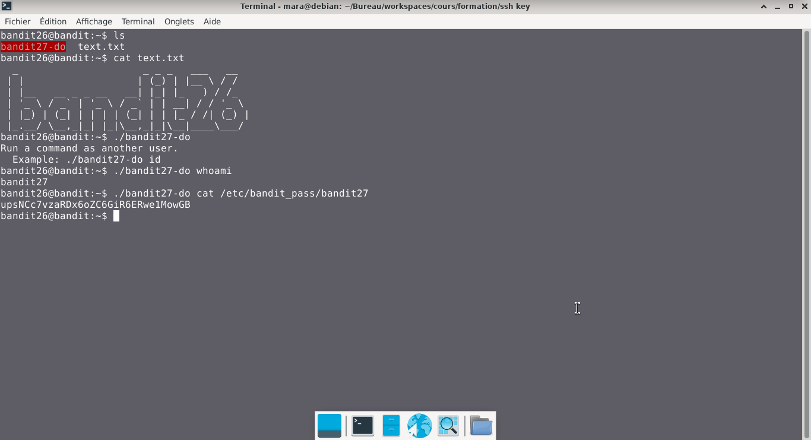

# Bandit — Niveau 26 → 27

## 📌 Informations
- **Plateforme :** OverTheWire
- **Série :** Bandit
- **Niveau :** 26 → 27
- **Difficulté :** Débutant
- **Date :** 21/06/2026

---

## 🎯 Objectif.  
Bon travail pour obtenir un shell ! Maintenant, dépêche-toi et saisis le mot de passe pour bandit27 !  

  ---

## 🔍 Réflexion avant de commencer.  
trouvons  le mot de passe depuis le programme bandit26


---

## 🛠️ Commandes données en indice

| Commande | Rôle |
|---|---|
| `man` | Permet de consulter la documentation d'une commande spécifique, il suffit de saisir man suivi du nom de la commande |
| `diff` | permet de comparer deux fichiers texte ligne par ligne.|
| `ncat` | permet de lire et d'écrire des données à travers le réseau en utilisant les protocoles TCP ou UDP. |
| `uniq` | Permet de filtrer les lignes répétées d'un fichier texte ou d'une entrée standard. |
| `strings` | Permet de rechercher et d'extraire des séquences de caractères lisibles (texte) dans des fichiers binaires ou des exécutables. |
| `base64` | Base64 est un système de codage utilisé pour convertir des données binaires en format texte en les encodant en une représentation en base 64.|

---


## 📖 Résolution

### Étape 1 — Connexion au serveur comme dans le challenge précédent


### Étape 2 — 

```bash
ls 
```

Résultat :
```
bandit27-do  text.txt

```


### Étape 3 — 
#

```bash
./bandit27-do
```

Résultat :
```
Run a command as another user.
  Example: ./bandit27-do id
```  
```bash  
./bandit27-do whoami
```  
Résultat :  
```
bandit27
```  


```bash  
./bandit27-do cat /etc/bandit_pass/bandit27
```  
Résultat :  
```
upsNCc7vzaRDx6oZC6GiR6ERwe1MowGB
```
## Visuel
  


## 🚩 Flag obtenu
```
upsNCc7vzaRDx6oZC6GiR6ERwe1MowGB
```  
 

---

## 🔗 Références
- [Page officielle Bandit](https://overthewire.org/wargames/bandit/)