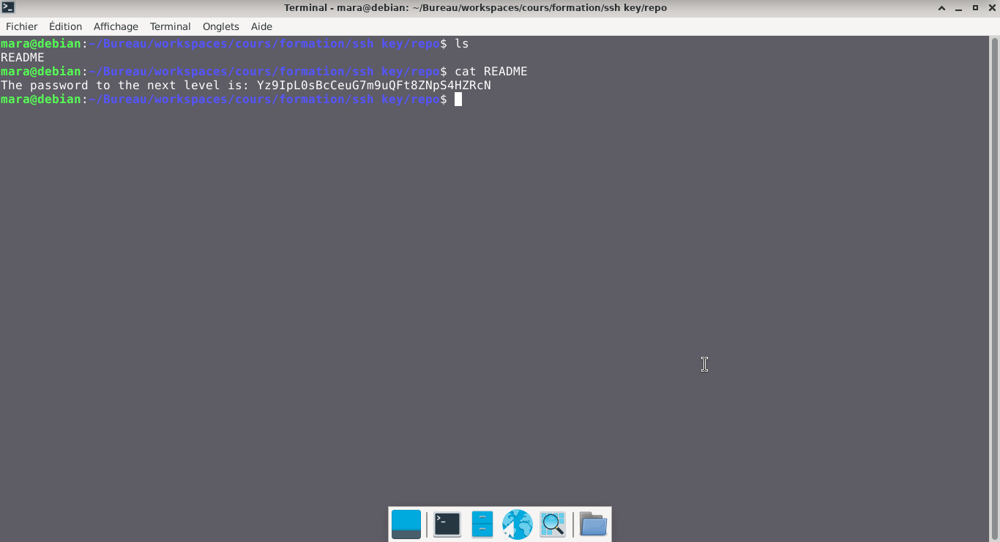

# Bandit — Niveau 27 → 28

## 📌 Informations
- **Plateforme :** OverTheWire
- **Série :** Bandit
- **Niveau :** 27 → 28
- **Difficulté :** Débutant
- **Date :** 21/06/2026

---

## 🎯 Objectif.  
Il y a un dépôt git à ssh://bandit27-git@bandit.labs.overthewire.org/home/bandit27-git/repo via le port 2220. Le mot de passe pour l’utilisateur bandit27-git est le même que pour l’utilisateur bandit27.

Depuis votre machine locale (pas la machine OverTheWire !), clonez le dépôt et trouvez le mot de passe pour le niveau suivant. Cela nécessite que git soit installé localement sur votre machine.

  ---

## 🔍 Réflexion avant de commencer.  
trouvons un moyen de cloner le dépôt GitHub


---

## 🛠️ Commandes données en indice

| Commande | Rôle |
|---|---|
| `man` | Permet de consulter la documentation d'une commande spécifique, il suffit de saisir man suivi du nom de la commande |
| `git` | Git est un système de contrôle de version décentralisé qui permet de suivre l'historique des modifications de vos fichiers, de gérer les versions de vos codes sources et de collaborer à plusieurs sans écraser le travail des autres.|
| `ncat` | permet de lire et d'écrire des données à travers le réseau en utilisant les protocoles TCP ou UDP. |
| `uniq` | Permet de filtrer les lignes répétées d'un fichier texte ou d'une entrée standard. |
| `strings` | Permet de rechercher et d'extraire des séquences de caractères lisibles (texte) dans des fichiers binaires ou des exécutables. |
| `base64` | Base64 est un système de codage utilisé pour convertir des données binaires en format texte en les encodant en une représentation en base 64.|

---


## 📖 Résolution

### Étape 1 — Clonnage du repo  
**Syntaxe de base :** `git clone ssh://git@<adresse_serveur>:<port>/<chemin_du_dépôt>.git`

```bash
ssh://bandit27-git@bandit.labs.overthewire.org:2220/home/bandit27-git/repo
```


### Étape 2 — 

```bash
cd repo
ls
```

Résultat :
```
README

```


### Étape 3 — 
#

```bash
cat README
```

Résultat :
```
The password to the next level is: Yz9IpL0sBcCeuG7m9uQFt8ZNpS4HZRcN

```  

## Visuel
  


## 🚩 Flag obtenu
```
Yz9IpL0sBcCeuG7m9uQFt8ZNpS4HZRcN
```  


---

## 💡 Ce que j'ai appris.  
- Le protocole : ssh:// indique à Git d'utiliser une connexion sécurisée par clé, et non par mot de passe standard. 
- L'utilisateur : git@ est l'identifiant système universel utilisé par la majorité des serveurs de code (GitHub, GitLab, serveurs privés).  
- Le port personnalisé : Le symbole : placé juste après l'adresse du serveur permet de forcer Git à passer par un port spécifique plutôt que le port 22 par défaut.  
- La sécurité : Cette commande nécessite obligatoirement que votre clé SSH publique soit préalablement enregistrée sur le serveur distant pour fonctionner. 

---

## 🔗 Références
- [Page officielle Bandit](https://overthewire.org/wargames/bandit/)