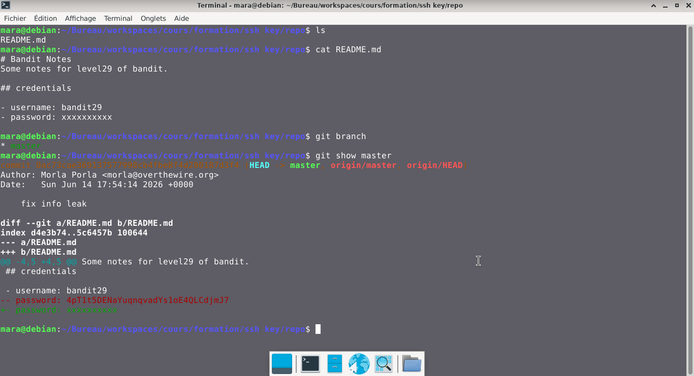

# Bandit — Niveau 28 → 29

## 📌 Informations
- **Plateforme :** OverTheWire
- **Série :** Bandit
- **Niveau :** 28 → 29
- **Difficulté :** Débutant
- **Date :** 21/06/2026

---

## 🎯 Objectif.  
Il y a un dépôt git à ssh://bandit28-git@bandit.labs.overthewire.org/home/bandit28-git/repo via le port 2220. Le mot de passe pour l’utilisateur bandit28-git est le même que pour l’utilisateur bandit27.

Depuis votre machine locale (pas la machine OverTheWire !), clonez le dépôt et trouvez le mot de passe pour le niveau suivant. Cela nécessite que git soit installé localement sur votre machine.

  ---

## 🔍 Réflexion avant de commencer.  
trouvons un moyen de cloner le dépôt GitHub


---

## 🛠️ Commandes données en indice

| Commande | Rôle |
|---|---|
| `man` | Permet de consulter la documentation d'une commande spécifique, il suffit de saisir man suivi du nom de la commande |
| `git` | Git est un système de contrôle de version décentralisé qui permet de suivre l'historique des modifications de vos fichiers, de gérer les versions de vos codes sources et de collaborer à plusieurs sans écraser le travail des autres.|
| `ncat` | permet de lire et d'écrire des données à travers le réseau en utilisant les protocoles TCP ou UDP. |
| `uniq` | Permet de filtrer les lignes répétées d'un fichier texte ou d'une entrée standard. |
| `strings` | Permet de rechercher et d'extraire des séquences de caractères lisibles (texte) dans des fichiers binaires ou des exécutables. |
| `base64` | Base64 est un système de codage utilisé pour convertir des données binaires en format texte en les encodant en une représentation en base 64.|

---


## 📖 Résolution

### Étape 1 — Clonnage du repo  
**Syntaxe de base :** `git clone ssh://git@<adresse_serveur>:<port>/<chemin_du_dépôt>.git`

```bash
ssh://bandit28-git@bandit.labs.overthewire.org:2220/home/bandit28-git/repo
```


### Étape 2 — 

```bash
cd repo
ls
```

Résultat :
```
README.md

```


### Étape 3 — 
#

```bash
cat README.md
```

Résultat :
```
# Bandit Notes
Some notes for level29 of bandit.

## credentials

- username: bandit29
- password: xxxxxxxxxx
RcN

```  
## cherchons les branches  
```bash  
git branch
```  
Résultat :  
```
* master
```  
## verifions le contenu de la branch  
```bash
git show master
```  
Résultat :  
```
commit 0ac73cae369137577998cb4fbe8f4d200187d3f4 (HEAD -> master, origin/master, origin/HEAD)
Author: Morla Porla <morla@overthewire.org>
Date:   Sun Jun 14 17:54:14 2026 +0000

    fix info leak

diff --git a/README.md b/README.md
index d4e3b74..5c6457b 100644
--- a/README.md
+++ b/README.md
@@ -4,5 +4,5 @@ Some notes for level29 of bandit.
 ## credentials
 
 - username: bandit29
-- password: 4pT1t5DENaYuqnqvadYs1oE4QLCdjmJ7
+- password: xxxxxxxxxx
```  


## Visuel
  


## 🚩 Flag obtenu
```
4pT1t5DENaYuqnqvadYs1oE4QLCdjmJ7
```  


---

## 💡 Ce que j'ai appris.  
Ce niveau démontre parfaitement que la visibilité locale n'est pas la visibilité globale. Ce n'est pas parce qu'un fichier n'est pas visible dans votre dossier actuel (ls) qu'il n'existe pas ailleurs dans les couches de l'historique Git. Pour un attaquant, le dossier .git est une mine d'or d'anciennes versions.
---

## 🔗 Références
- [Page officielle Bandit](https://overthewire.org/wargames/bandit/)