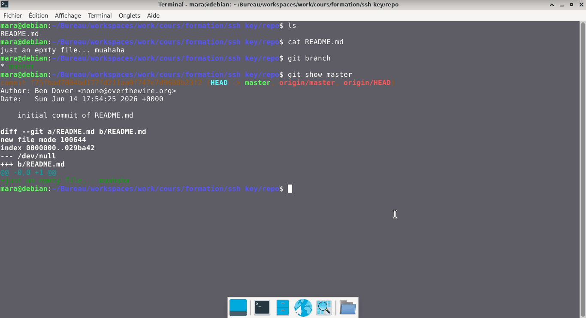
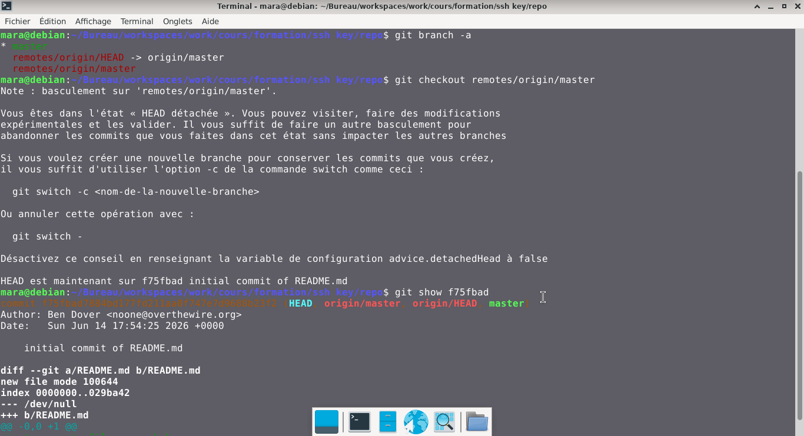
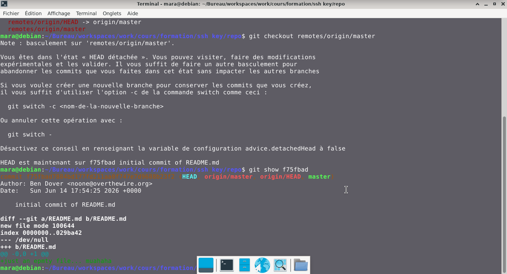
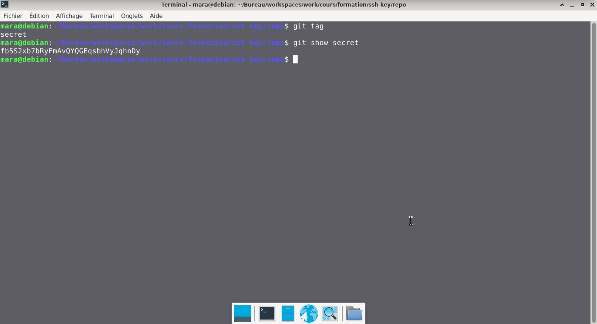

# Bandit — Niveau 30 → 31

## 📌 Informations
- **Plateforme :** OverTheWire
- **Série :** Bandit
- **Niveau :** 30 → 31
- **Difficulté :** Débutant
- **Date :** 21/06/2026

---

## 🎯 Objectif.  
Il y a un dépôt git à ssh://bandit29-git@bandit.labs.overthewire.org/home/bandit29-git/repo via le port 2220. Le mot de passe pour l’utilisateur bandit29-git est le même que pour l’utilisateur bandit27.

Depuis votre machine locale (pas la machine OverTheWire !), clonez le dépôt et trouvez le mot de passe pour le niveau suivant. Cela nécessite que git soit installé localement sur votre machine.

  ---

## 🔍 Réflexion avant de commencer.  
trouvons le mot de passe du niveau suivant

---

## 🛠️ Commandes données en indice

| Commande | Rôle |
|---|---|
| `man` | Permet de consulter la documentation d'une commande spécifique, il suffit de saisir man suivi du nom de la commande |
| `git` | Git est un système de contrôle de version décentralisé qui permet de suivre l'historique des modifications de vos fichiers, de gérer les versions de vos codes sources et de collaborer à plusieurs sans écraser le travail des autres.|
| `ncat` | permet de lire et d'écrire des données à travers le réseau en utilisant les protocoles TCP ou UDP. |
| `uniq` | Permet de filtrer les lignes répétées d'un fichier texte ou d'une entrée standard. |
| `strings` | Permet de rechercher et d'extraire des séquences de caractères lisibles (texte) dans des fichiers binaires ou des exécutables. |
| `base64` | Base64 est un système de codage utilisé pour convertir des données binaires en format texte en les encodant en une représentation en base 64.|

---


## 📖 Résolution

### Étape 1 — Clonnage du repo  
**Syntaxe de base :** `git clone ssh://git@<adresse_serveur>:<port>/<chemin_du_dépôt>.git`

```bash
ssh://bandit30-git@bandit.labs.overthewire.org:2220/home/bandit30-git/repo
```


### Étape 2 — 

```bash
cd repo
ls
```

Résultat :
```
README.md

```


### Étape 3 — 
#

```bash
cat README.md
```

Résultat :
```
just an epmty file... muahaha
```  
## cherchons les branches  
```bash  
git branch
```  
Résultat :  
```
* master
```  
## verifions le contenu de la branch  
```bash
git show master
```  
Résultat :  
```
commit f75fbad7884bd177fd211aa0f747e7d9688b23f2 (HEAD -> master, origin/master, origin/HEAD)
Author: Ben Dover <noone@overthewire.org>
Date:   Sun Jun 14 17:54:25 2026 +0000

    initial commit of README.md

diff --git a/README.md b/README.md
new file mode 100644
index 0000000..029ba42
--- /dev/null
+++ b/README.md
@@ -0,0 +1 @@
+just an epmty file... muahaha

```   
## Visuel
  

### - nous allons afficher toutes les branches, même celles qui sont  distantes  
```bash
git branch -a  
```  
Résultat :  
```
* master
  remotes/origin/HEAD -> origin/master
  remotes/origin/master
```  

### - nous allons basculer sur la branche dev  
```bash
git checkout remotes/origin/master  
```  
Résultat :    
```
Note : basculement sur 'remotes/origin/master'.

Vous êtes dans l'état « HEAD détachée ». Vous pouvez visiter, faire des modifications
expérimentales et les valider. Il vous suffit de faire un autre basculement pour
abandonner les commits que vous faites dans cet état sans impacter les autres branches

Si vous voulez créer une nouvelle branche pour conserver les commits que vous créez,
il vous suffit d'utiliser l'option -c de la commande switch comme ceci :

  git switch -c <nom-de-la-nouvelle-branche>

Ou annuler cette opération avec :

  git switch -

Désactivez ce conseil en renseignant la variable de configuration advice.detachedHead à false

HEAD est maintenant sur f75fbad initial commit of README.md

```  
**Remarque :** Avez vous vu le message `HEAD est maintenant sur f75fbad add data needed for development`  

### - verifions le contenu de la branch    
```bash
git show f75fbad
```
Résultat :    
```
commit f75fbad7884bd177fd211aa0f747e7d9688b23f2 (HEAD, origin/master, origin/HEAD, master)
Author: Ben Dover <noone@overthewire.org>
Date:   Sun Jun 14 17:54:25 2026 +0000

    initial commit of README.md

diff --git a/README.md b/README.md
new file mode 100644
index 0000000..029ba42
--- /dev/null
+++ b/README.md
@@ -0,0 +1 @@
+just an epmty file... muahaha

```  


## Visuel

  
### - listons les tags  
```bash
git tag
```  

Résultat :  
```
secret
```
```bash
git show secret
```

## 🚩 Flag obtenu
```
fb5S2xb7bRyFmAvQYQGEqsbhVyJqhnDy
```  


---

## 💡 Ce que j'ai appris.  

Ce niveau démontre parfaitement que la visibilité locale n'est pas la visibilité globale. Ce n'est pas parce qu'un fichier n'est pas visible dans votre dossier actuel (ls) qu'il n'existe pas ailleurs dans les couches de l'historique Git. Pour un attaquant, le dossier .git est une mine d'or d'anciennes versions.    

---  


## 🔗 Références
- [Page officielle Bandit](https://overthewire.org/wargames/bandit/)