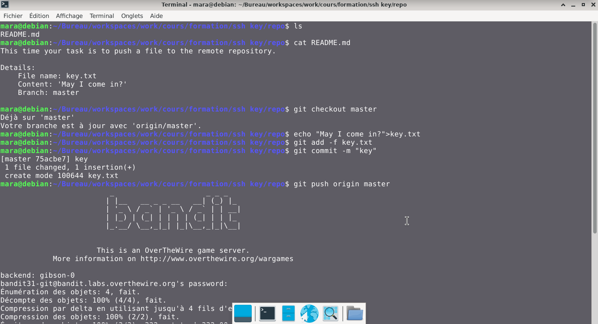
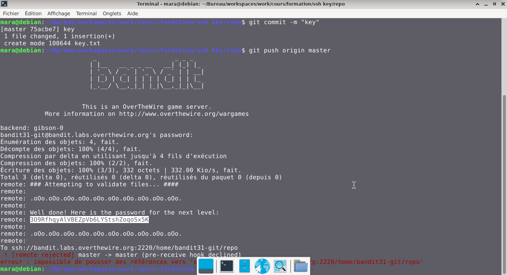

# Bandit — Niveau 31 → 32

## 📌 Informations
- **Plateforme :** OverTheWire
- **Série :** Bandit
- **Niveau :** 31 → 32
- **Difficulté :** Débutant
- **Date :** 21/06/2026

---

## 🎯 Objectif.  
Il y a un dépôt git à ssh://bandit31-git@bandit.labs.overthewire.org/home/bandit31-git/repo via le port 2220. Le mot de passe pour l’utilisateur bandit31-git est le même que pour l’utilisateur bandit31.

Depuis votre machine locale (pas la machine OverTheWire !), clonez le dépôt et trouvez le mot de passe pour le niveau suivant. Cela nécessite que git soit installé localement sur votre machine.

  ---

## 🔍 Réflexion avant de commencer.  
trouvons le mot de passe du niveau suivant

---

## 🛠️ Commandes données en indice

| Commande | Rôle |
|---|---|
| `man` | Permet de consulter la documentation d'une commande spécifique, il suffit de saisir man suivi du nom de la commande |
| `git` | Git est un système de contrôle de version décentralisé qui permet de suivre l'historique des modifications de vos fichiers, de gérer les versions de vos codes sources et de collaborer à plusieurs sans écraser le travail des autres.|
| `ncat` | permet de lire et d'écrire des données à travers le réseau en utilisant les protocoles TCP ou UDP. |
| `uniq` | Permet de filtrer les lignes répétées d'un fichier texte ou d'une entrée standard. |
| `strings` | Permet de rechercher et d'extraire des séquences de caractères lisibles (texte) dans des fichiers binaires ou des exécutables. |
| `base64` | Base64 est un système de codage utilisé pour convertir des données binaires en format texte en les encodant en une représentation en base 64.|

---


## 📖 Résolution

### Étape 1 — Clonnage du repo  
**Syntaxe de base :** `git clone ssh://git@<adresse_serveur>:<port>/<chemin_du_dépôt>.git`

```bash
ssh://bandit31-git@bandit.labs.overthewire.org:2220/home/bandit31-git/repo
```


### Étape 2 — 

```bash
cd repo
ls
```

Résultat :
```
README.md

```


### Étape 3 — 
#

```bash
cat README.md
```

Résultat :
```
This time your task is to push a file to the remote repository.

Details:
    File name: key.txt
    Content: 'May I come in?'
    Branch: master

```  
## nous devons donc nous mettre sur la branche master 
```bash  
git checkout master
```  
Résultat :  
```
Déjà sur 'master'
Votre branche est à jour avec 'origin/master'.
```  
## nous devons créer le fichier key.txt qui doit contenir le message "May I come in?" et le pousser sur la branche master  
### -creer le fichier key.txt  

```bash
echo "May I come in?">key.txt
```  
### - Forcer l'ajout du fichier   
```bash
git add -f key.txt
```  
```bash
git commit -m "key"
```  
```bash 
git push origin master
```  

Résultat :  
```
                         _                     _ _ _   
                        | |__   __ _ _ __   __| (_) |_ 
                        | '_ \ / _` | '_ \ / _` | | __|
                        | |_) | (_| | | | | (_| | | |_ 
                        |_.__/ \__,_|_| |_|\__,_|_|\__|
                                                       

                      This is an OverTheWire game server. 
            More information on http://www.overthewire.org/wargames

backend: gibson-0
bandit31-git@bandit.labs.overthewire.org's password: 
Énumération des objets: 4, fait.
Décompte des objets: 100% (4/4), fait.
Compression par delta en utilisant jusqu'à 4 fils d'exécution
Compression des objets: 100% (2/2), fait.
Écriture des objets: 100% (3/3), 332 octets | 332.00 Kio/s, fait.
Total 3 (delta 0), réutilisés 0 (delta 0), réutilisés du paquet 0 (depuis 0)
remote: ### Attempting to validate files... ####
remote: 
remote: .oOo.oOo.oOo.oOo.oOo.oOo.oOo.oOo.oOo.oOo.
remote: 
remote: Well done! Here is the password for the next level:
remote: 3O9RfhqyAlVBEZpVb6LYStshZoqoSx5K
remote: 
remote: .oOo.oOo.oOo.oOo.oOo.oOo.oOo.oOo.oOo.oOo.
remote: 
To ssh://bandit.labs.overthewire.org:2220/home/bandit31-git/repo
 ! [remote rejected] master -> master (pre-receive hook declined)
erreur : impossible de pousser des références vers 'ssh://bandit.labs.overthewire.org:2220/home/bandit31-git/repo'


```   
## Visuel
 
  


## 🚩 Flag obtenu
```
3O9RfhqyAlVBEZpVb6LYStshZoqoSx5K
```  


---

## 💡 Ce que j'ai appris.  

J’ai retenu la chaîne d'actions : indexer de force un fichier (même ignoré) avec git add -f, puis enregistrer mon message de modification via git commit -m.Enfin, j’ai appris à envoyer ces modifications locales directement vers la branche principale du serveur en ligne avec git push origin master

---  


## 🔗 Références
- [Page officielle Bandit](https://overthewire.org/wargames/bandit/)