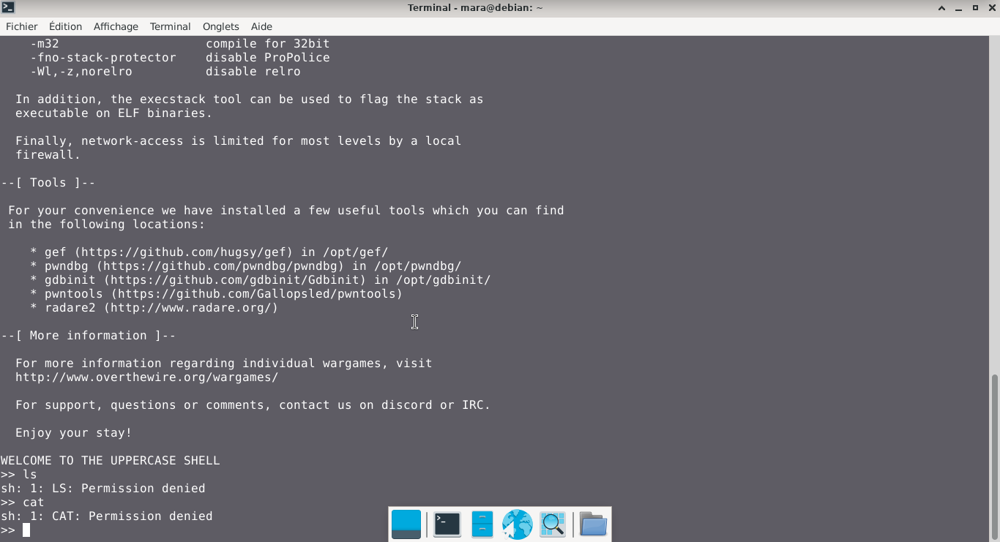
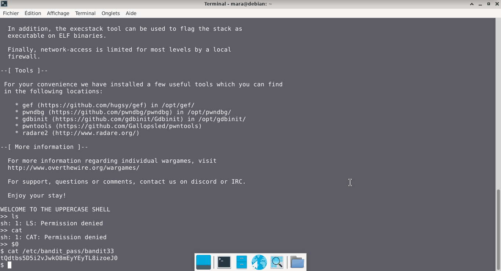

# Bandit — Niveau 32 → 33

## 📌 Informations
- **Plateforme :** OverTheWire
- **Série :** Bandit
- **Niveau :** 32 → 33
- **Difficulté :** Débutant
- **Date :** 22/06/2026

---

## 🎯 Objectif.  

Après tout ce bazar, il est temps de s’évader à nouveau. Bonne chance !

  ---

## 🔍 Réflexion avant de commencer.  
trouvons un moyen de trouver le mot de passe.


---

## 🛠️ Commandes données en indice

| Commande | Rôle |
|---|---|
| `man` | Permet de consulter la documentation d'une commande spécifique, il suffit de saisir man suivi du nom de la commande |
| `diff` | permet de comparer deux fichiers texte ligne par ligne.|
| `ncat` | permet de lire et d'écrire des données à travers le réseau en utilisant les protocoles TCP ou UDP. |
| `uniq` | Permet de filtrer les lignes répétées d'un fichier texte ou d'une entrée standard. |
| `strings` | Permet de rechercher et d'extraire des séquences de caractères lisibles (texte) dans des fichiers binaires ou des exécutables. |
| `base64` | Base64 est un système de codage utilisé pour convertir des données binaires en format texte en les encodant en une représentation en base 64.|

---


## 📖 Résolution

### Étape 1 — Connexion au serveur

```bash
ssh bandit32@bandit.labs.overthewire.org -p 2220
```


### Étape 2 — 

```bash
ls 
cat
```
### visuel  


**Remarque :** nous sommes dans un shell restreint qui transforme les lettres minuscules en majuscules  
### cherchons à obtenir un shell normal  
```bash
$0
```
  

Résultat :
```
$
```


### Étape 3 — 
#

```bash
cat /etc/bandit_pass/bandit33
```

Résultat :
```
tQdtbs5D5i2vJwkO8mEyYEyTL8izoeJ0
```  

## Visuel
  


## 🚩 Flag obtenu
```
tQdtbs5D5i2vJwkO8mEyYEyTL8izoeJ0
```  


---

## 💡 Ce que j'ai appris.  
 `$0` correspond au nom du shell courant donc en tappant, on lance un nouveau shell normal.

---

## 🔗 Références
- [Page officielle Bandit](https://overthewire.org/wargames/bandit/)