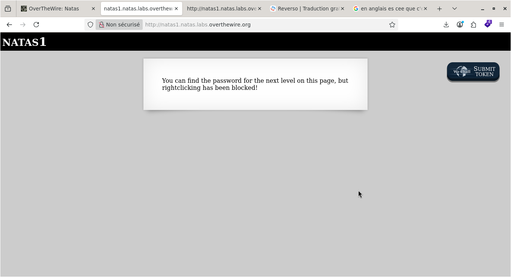
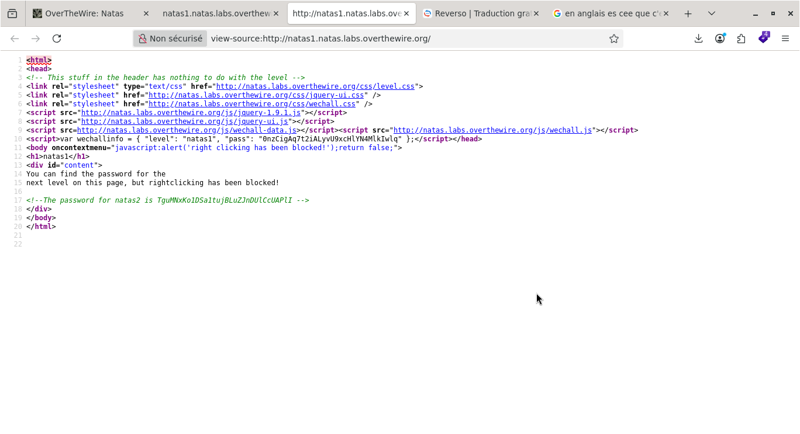

# Natas — Niveau 0

## 📌 Informations
- **Plateforme :** OverTheWire
- **Série :** Natas
- **Niveau :** 1
- **Catégorie :** Sécurité Web
- **Date :** 11/07/2026

---

## 🎯 Objectif
Trouver le mot de passe du niveau suivant (**natas2**) et se connecter à :
`http://natas2.natas.labs.overthewire.org`

---

## 🔍 Approche
Le mot de passe est caché quelque part sur la page ou accessible via une vulnérabilité web.
Chaque niveau demande de trouver et d'exploiter une faille spécifique pour le récupérer.

---

## 🛠️ Résolution

**URL :** `http://natas1.natas.labs.overthewire.org`

**Étapes :**

**Steps :**

1. _Première action_  
### faire un click droit et chooisir code source de la page ou ctl+U  

2. _Result_

---  
## 🚩 Flag  
vsDOxoXyq3wckCP1ZmTZ71ngIA606odB

---

## 💡 Ce que j'ai appris
- - Les données sensibles (mots de passe, clés API, tokens) ne doivent 
  JAMAIS être stockées dans le code source HTML/JavaScript — elles sont 
  visibles publiquement par n'importe qui avec Ctrl+U.

- Les variables JavaScript côté frontend ne sont pas privées — 
  elles sont envoyées au navigateur de chaque visiteur par défaut.

- Cette vulnérabilité s'appelle Information Disclosure — 
  c'est une des premières choses à vérifier lors d'un audit de sécurité web.

- La sécurité par l'obscurité (comme désactiver le clic droit) 
  n'est pas une vraie protection — elle peut toujours être contournée.

---

## 🔗 Reference
- [Natas Official Page](https://overthewire.org/wargames/natas/)